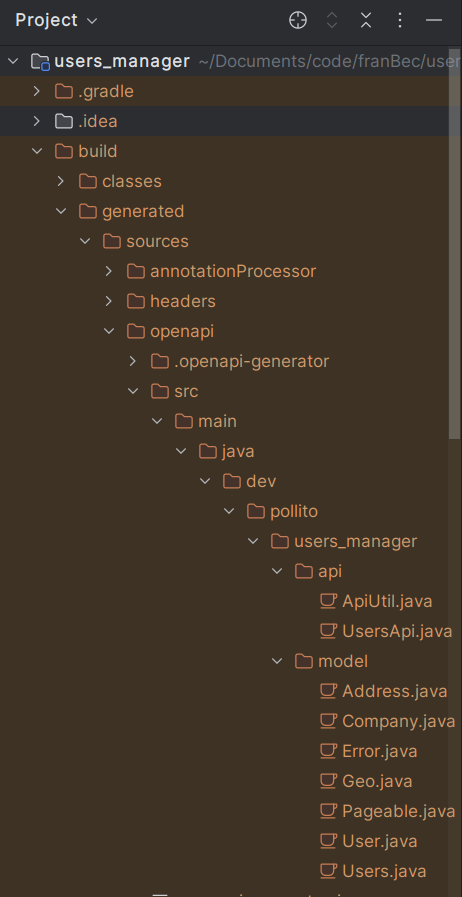

# Generate Code From The Contract

If we were to write by hand these two endpoints and the needed Models (called Schemas in the OpenAPI Specification) it may not be that complicated. But imagine if it was a big project, with a few dozen endpoints and close to a hundred schemas…

Let’s save us some problems by using one of the greatest libraries to ever exist: [openapi-generator](https://github.com/OpenAPITools/openapi-generator).

1. In your `build.gradle`, **add the plugin** in the `plugins section` (usually at the start of the file):

    ```gradle
    id 'org.openapi.generator' version '7.12.0'
    ```

2. We need [Swagger Core Jakarta](https://mvnrepository.com/artifact/io.swagger.core.v3/swagger-core-jakarta), [JsonNullable Jackson Module](https://mvnrepository.com/artifact/org.openapitools/jackson-databind-nullable), and [Spring Boot Starter Validation](https://mvnrepository.com/artifact/org.springframework.boot/spring-boot-starter-validation) dependencies. In your `build.gradle`, **add the dependency** in the `dependencies` section:

    ```gradle
    implementation 'io.swagger.core.v3:swagger-core-jakarta:2.2.28'
    implementation 'org.openapitools:jackson-databind-nullable:0.2.6'
    implementation 'org.springframework.boot:spring-boot-starter-validation'
    ```

3. **Configure** the openapi-generator at the bottom of build.gradle:

    ```gradle
    openApiGenerate {
        apiPackage = "${group}.${project.name}.api".toString()
        configOptions = [
            interfaceOnly: "true",
            skipOperationExample: "true",
            useEnumCaseInsensitive: "true",
            useSpringBoot3: "true"
        ]
        generateApiTests = false
        generateApiDocumentation = false
        generateModelTests = false
        generateModelDocumentation = false
        generatorName = "spring"
        inputSpec = "$rootDir/src/main/resources/openapi/users_manager.yaml".toString()
        modelPackage = "${group}.${project.name}.model".toString()
        outputDir = layout.buildDirectory.dir("generated/sources/openapi").get().asFile.toString()
    }
    ```

    * You can find more information about the different possible configurations in the [OpenAPI Generator Gradle Plugin GitHub page](https://github.com/OpenAPITools/openapi-generator/tree/master/modules/openapi-generator-gradle-plugin).
    * It is **important** to make sure that input spec is pointing to the desired OpenAPI Specification yaml file.

4. **Generate code on compilation**, by adding a new task:

    ```gradle
    tasks.named('compileJava') {
        dependsOn 'openApiGenerate'
    }
    ```

5. Now that everything is set up, **run the Build Task**. When the task finishes, If you check the `build\generated\sources\openapi` folder, you’ll find the representation of the OpenAPI Specification (our contract) in Java code, ready to be used.

    