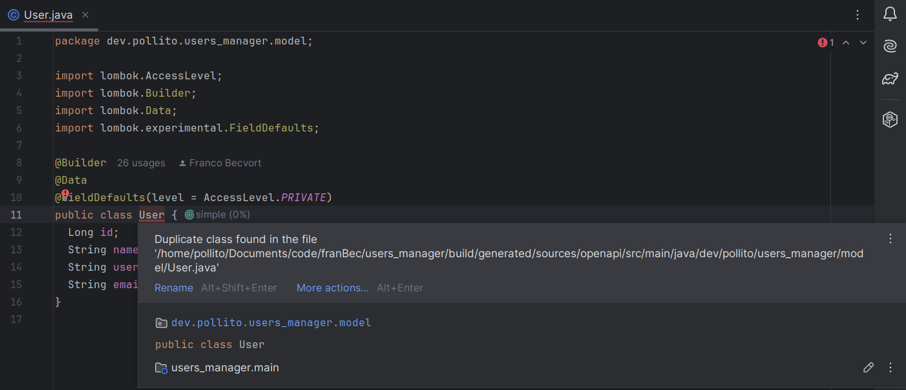
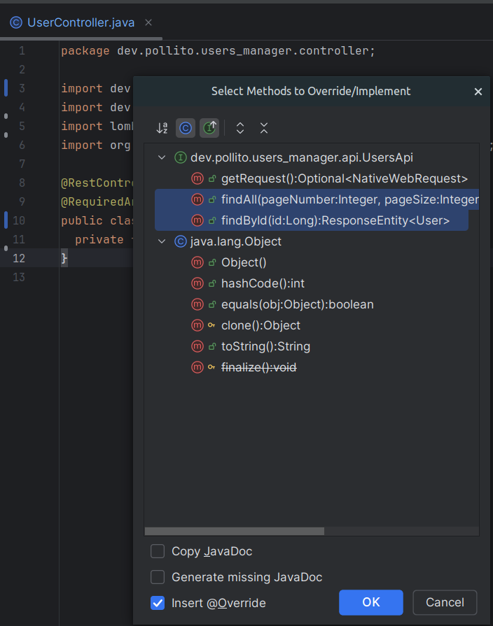
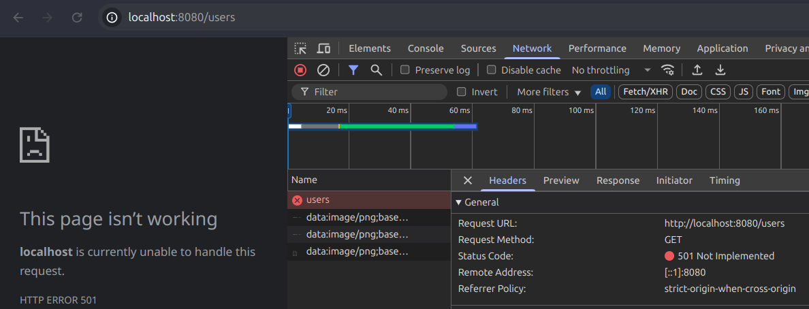

# Use The Generated Code

## Delete The Model We Previously Wrote

If we go to `src/main/java/dev/pollito/users_manager/model/User.java`, we will find the following error:



That is because the openapi-generator plugin already created a `User` class at the same path, but in the build folder.

* **We want to use the generated class instead**, so delete the class (and the whole `model` package) we created by hand.

## Fix Whatever Broke

The openapi-generator generated `User` has a slightly different way of implementing the [Builder design pattern](https://refactoring.guru/design-patterns/builder/typescript/example) compared to the one we crated before using lombok. This replacement breaks `UserServiceImpl` hardcoded `User`, but it is a really simple fix.

* Before fix:

    ```java
    private static final User USER_1 =
      User.builder()
          .id(1L)
          .name("Leanne Graham")
          .username("Bret")
          .email("Sincere@april.biz")
          .build();
    ```

* After fix:

    ```java
    private static final User USER_1 =
      new User()
          .id(1L)
          .name("Leanne Graham")
          .username("Bret")
          .email("Sincere@april.biz");
    ```

## Implement The Generated API Interface

Right now the `controller` looks like this:

```java
package dev.pollito.users_manager.controller;

import dev.pollito.users_manager.model.User;
import dev.pollito.users_manager.service.UserService;
import java.util.List;
import lombok.RequiredArgsConstructor;
import org.springframework.web.bind.annotation.GetMapping;
import org.springframework.web.bind.annotation.RestController;

@RestController
@RequiredArgsConstructor
public class UserController {
  private final UserService userService;

  @GetMapping("/users")
  public List<User> getUsers() {
    return userService.getUsers();
  }
}
```

Let's rewrite it so we implement the generated API Interface

1. **Delete all business logic**. The `controller` should look kinda empty, like this:

    ```java
    package dev.pollito.users_manager.controller;
    
    import dev.pollito.users_manager.api.UsersApi;
    import dev.pollito.users_manager.service.UserService;
    import lombok.RequiredArgsConstructor;
    import org.springframework.web.bind.annotation.RestController;
    
    @RestController
    @RequiredArgsConstructor
    public class UserController implements UsersApi {
      private final UserService userService;
    }
    ```

2. **Implement the generated interface**.

    ```java
    package dev.pollito.users_manager.controller;
    
    import dev.pollito.users_manager.api.UsersApi;
    import dev.pollito.users_manager.service.UserService;
    import lombok.RequiredArgsConstructor;
    import org.springframework.web.bind.annotation.RestController;
    
    @RestController
    @RequiredArgsConstructor
    public class UserController implements UsersApi {
      private final UserService userService;
    }
    ```

3. **Select methods to override**: If you are using IntelliJ IDEA, by pressing `CTRL+O` anywhere in the class, you'll see a popup asking which methods to override.
    
    
    
    Select those we are interested in: `findAll` and `findById`
    
    Now the controller should look something like this:
    
    ```java
    package dev.pollito.users_manager.controller;
    
    import dev.pollito.users_manager.api.UsersApi;
    import dev.pollito.users_manager.model.User;
    import dev.pollito.users_manager.model.Users;
    import dev.pollito.users_manager.service.UserService;
    import lombok.RequiredArgsConstructor;
    import org.springframework.http.ResponseEntity;
    import org.springframework.web.bind.annotation.RestController;
    
    import java.util.List;
    
    @RestController
    @RequiredArgsConstructor
    public class UserController implements UsersApi {
      private final UserService userService;
    
      @Override
      public ResponseEntity<Users> findAll(Integer pageNumber, Integer pageSize, List<String> pageSort) {
        return UsersApi.super.findAll(pageNumber, pageSize, pageSort);
      }
    
      @Override
      public ResponseEntity<User> findById(Long id) {
        return UsersApi.super.findById(id);
      }
    }
    ```

Right-click the main class → Run. Then go to [http://localhost:8080/users](http://localhost:8080/users). You should get `501 NOT IMPLEMENTED`.



## Now What?

You may be thinking:

> OK nice, but how can I return a user again?

