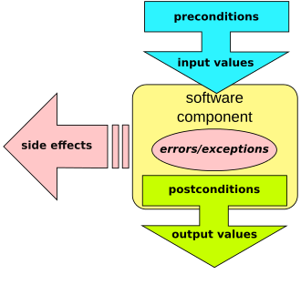

# What is a Contract?

In the [Design by contract wikipedia article](https://en.wikipedia.org/wiki/Design_by_contract), we can find the following affirmation:

> […] software designers should define formal, precise and verifiable interface specifications for software components, which extend the ordinary definition of abstract data types with preconditions, postconditions and invariants.

From that, I made my own adaptation of the Contract-Driven Development philosophy for microservices architecture:

> Microservices must comply with a contract, which defines inputs, outputs, and errors.

So, **what is a contract?** Is a **set of assertions** containing the following information:

* **Valid input values**, and their meaning.
* **Valid return values**, and their meaning.
* **Error values that can occur**, and their meaning.

In a Contract there are two parties:

* **Consumer**: provides the input values and waits for the return.
* **Provider**: waits for the input values and provides the return.