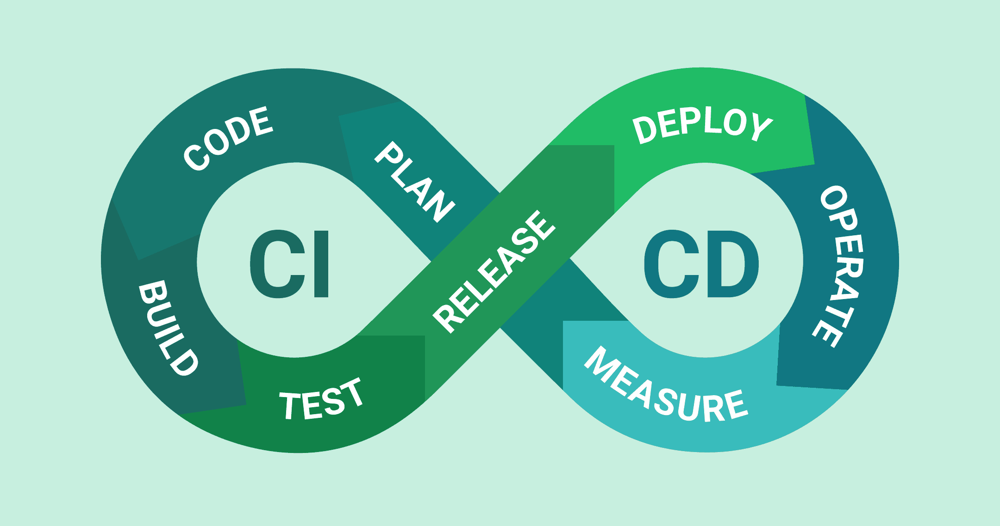

import YouTube from '@site/src/components/YouTube';

# Deploy Your App

Getting your Spring Boot application running reliably for your users is the final, crucial step. Deployment strategies vary wildly depending on the team, the company's maturity, and the project's scale. Let's look at a couple of approaches I've encountered and discuss modern best practices.

## Deployment Methods

### The "Old School" Manual Way (And Why It's Risky)

At my first job, deploying our Spring Boot application (packaged as a `WAR` file) was a tense, manual ritual:

1.  **Remote desktop:** Connect to the production Virtual Machine using a Remote Desktop client.
2.  **Stop the server:** Manually stop the [Apache Tomcat](https://tomcat.apache.org/) instance running the current application version. This meant **downtime** for users.
3.  **Replace the file:** Navigate the server's file system, delete the old `app.war` file, and copy the new `app.war` file (uploaded manually).
4.  **Start the server:** Manually start the Tomcat instance again.
5.  **Pray:** Hope everything worked, check logs frantically, and manually test critical features.

**Why this is not optimal (and borderline unprofessional today):**

*   **High risk of human error:** Copying the wrong file, deleting something important, misconfiguring Tomcat – manual steps are prone to mistakes.
*   **Downtime:** Stopping the server means the application is unavailable to users during deployment.
*   **No easy rollback:** If the new version fails, rolling back involves repeating the manual process in reverse, often under pressure.
*   **Lack of auditability:** Who deployed what, when, and how? Manual processes leave poor trails.
*   **Not scalable:** Imagine doing this for tens or hundreds of microservices. It's unsustainable.
*   **Stressful:** Manual deployments are often high-pressure events, leading to burnout and mistakes.

While this might work for a tiny internal tool, it's completely inadequate for serious applications.

### The Modern Way: CI/CD Pipelines & Containerization

The most common and professional way to deploy Spring Boot applications today involves automation through a [Continuous Integration/Continuous Deployment (CI/CD) pipeline](https://www.redhat.com/en/topics/devops/what-is-ci-cd), often leveraging containerization (like Docker). Here’s a typical flow triggered by a `git push` to a specific branch (e.g., `main` or `release`):

1.  **Code push:** A developer pushes code changes to the Git repository.
2.  **Automated testing:** The pipeline automatically runs unit tests, integration tests, and potentially other quality checks (like static code analysis with [SonarQube](https://www.sonarsource.com/products/sonarqube/)). If tests fail, the pipeline stops, preventing faulty code from proceeding.
3.  **Build & dockerize:** If tests pass, the pipeline builds the Spring Boot application (creating a `JAR` file) and then builds a Docker image using the `Dockerfile` we discussed earlier. This packages the application and its dependencies into a standardized, portable container.
4.  **Push image to registry:** The newly built Docker image is tagged (e.g., with the commit hash or version number) and pushed to a [container registry](https://www.redhat.com/en/topics/cloud-native-apps/what-is-a-container-registry) (like [Docker Hub](https://hub.docker.com/), [Google Artifact Registry](https://cloud.google.com/artifact-registry), [AWS ECR](https://aws.amazon.com/ecr/)).
5.  **(Optional) Approval gate:** In many setups, especially for production deployments, the pipeline might pause and require manual approval from a team lead, QA, or manager before proceeding.
6.  **Deployment:** The pipeline triggers the deployment of the new container image to the target environment.

This automated approach offers huge advantages: consistency, reliability, speed, auditability, and automated rollbacks (if configured).

## Safe Deployments: Gradual Traffic Rollout

Pushing a new version live instantly to all users, even after testing, carries risk. Modern deployment strategies often involve deploying the new version *without* immediately sending user traffic to it, then gradually shifting traffic.

1.  **Deploy new version:** The new application version (v2) is deployed alongside the currently running version (v1). Both are running, but initially, all user traffic still goes to v1.
2.  **Internal testing:** The team can test v2 using internal URLs or specific routing rules to ensure it's working correctly in the production environment.
3.  **Incremental traffic increase:** Using load balancers or service meshes, traffic is gradually shifted from v1 to v2:
    *   Start with a small percentage (e.g., 1%, 5%, 10%) going to v2.
    *   Monitor key metrics (errors, latency, resource usage) closely.
    *   If metrics look good, increase the percentage (e.g., 25%, 50%, 75%).
    *   If issues arise, immediately shift traffic back to v1 (rollback) and investigate.
4.  **Full rollout:** Once confidence is high and v2 handles 100% of the traffic stably, the old v1 instances can be scaled down and removed.

This technique (often part of [Blue-Green](https://www.redhat.com/en/topics/devops/what-is-blue-green-deployment) or [Canary](https://www.jetbrains.com/teamcity/ci-cd-guide/concepts/canary-release/) deployment strategies) significantly reduces the risk of failed deployments impacting users and allows for zero-downtime releases.

## Recommendation For Personal/PoC Projects: PaaS Free Tiers

Setting up a full CI/CD pipeline is overkill for personal projects, proof-of-concepts (PoCs), or small demos. For these scenarios, Platform-as-a-Service (PaaS) providers offer excellent free tiers.

For Spring Boot applications (packaged as JARs), I've found **[Render.com](https://render.com/)** to be a great option:

*   **Easy Setup:** Connect your GitHub/GitLab repository, point it to your Spring Boot project.
*   **Free Tier:** Generous enough for small applications.
*   **Automatic Deploys:** Deploys automatically on pushes to your specified branch.
*   **Managed Infrastructure:** Handles servers, networking, and basic scaling for you.

**Main Limitation:** The free tier often experiences [cold starts](https://medium.com/@ilakk2023/overcoming-the-cold-start-problem-in-microservices-strategies-and-aws-solutions-2f93fc1e59a6). If your application hasn't received traffic for a while, the container might be shut down to save resources. The next request will trigger it to start up again, causing a noticeable delay (several seconds) for that first user. This is usually acceptable for personal projects but not for production applications needing consistent low latency.

**I really recommend** Daniele Leão's video "DEPLOY SPRING BOOT NO RENDER".

<YouTube id="fwWvgk_SW2g" />

Happy deploying! 🚀