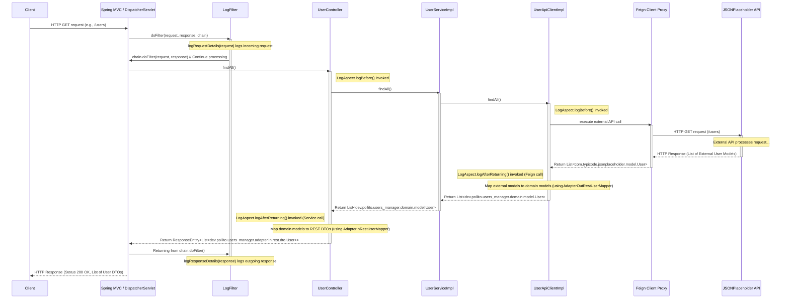

# Configure the Generated Feign Client API

So far we've used the [OpenAPI Generator Gradle Plugin](https://github.com/OpenAPITools/openapi-generator/tree/master/modules/openapi-generator-gradle-plugin) to generate the representation of the external API we want to integrate.

<div>
  
</div>

But we are not using any of that code in our application yet. Let's change that.

## Mapper

It converts between API response models and domain models.

<div>
  
</div>

_Other folders are omitted for simplicity._

```java title="src/main/java/dev/pollito/users_manager/adapter/out/rest/mapper/AdapterOutRestUserMapper.java"
package dev.pollito.users_manager.adapter.out.rest.mapper;

import static org.mapstruct.MappingConstants.ComponentModel.SPRING;

import dev.pollito.users_manager.domain.model.User;
import org.mapstruct.Mapper;

@Mapper(componentModel = SPRING)
public interface AdapterOutRestUserMapper {
  User map(com.typicode.jsonplaceholder.model.User u);
}
```

### Spring Bean Registration Mapper Conflict

Why does this mapper have a long name (`AdapterOutRestUserMapper`) instead of a simple one (like `UserMapper`)? That's because in our project, the name `UserMapper` is already taken by `src/main/java/dev/pollito/users_manager/adapter/in/rest/mapper/UserMapper.java`.

* When using `@Mapper(componentModel = SPRING)`, the generated implementations are registered as Spring beans.
* Spring requires unique bean identifiers, and same-named classes cause conflicts.

Personal recommendation: for consistency, rename `src/main/java/dev/pollito/users_manager/adapter/in/rest/mapper/UserMapper.java` to `src/main/java/dev/pollito/users_manager/adapter/in/rest/mapper/AdapterInRestUserMapper.java`

## Secondary Port

Create a Secondary Port.

<div>
  
</div>

_Other folders are omitted for simplicity._

```java title="src/main/java/dev/pollito/users_manager/domain/port/out/UserApiClient.java"
package dev.pollito.users_manager.domain.port.out;

import dev.pollito.users_manager.domain.model.User;
import java.util.List;
import java.util.Optional;

public interface UserApiClient {
  List<User> findAll();

  Optional<User> findById(Long id);
}
```

## Secondary Adapter (REST)

Create an adapter that implements the Secondary Port.

<div>
  
</div>

_Other folders are omitted for simplicity._

```java title="src/main/java/dev/pollito/users_manager/adapter/out/rest/UserApiClientImpl.java"
package dev.pollito.users_manager.adapter.out.rest;

import com.typicode.jsonplaceholder.api.UserApi;
import dev.pollito.users_manager.adapter.out.rest.mapper.AdapterOutRestUserMapper;
import dev.pollito.users_manager.config.feign.FeignException;
import dev.pollito.users_manager.domain.model.User;
import dev.pollito.users_manager.domain.port.out.UserApiClient;
import java.util.List;
import java.util.Optional;
import lombok.RequiredArgsConstructor;
import org.springframework.http.HttpStatus;
import org.springframework.stereotype.Service;

@Service
@RequiredArgsConstructor
public class UserApiClientImpl implements UserApiClient {
  private final UserApi userApi;
  private final AdapterOutRestUserMapper adapterOutRestUserMapper;

  @Override
  public List<User> findAll() {
    return userApi.findAll().stream().map(adapterOutRestUserMapper::map).toList();
  }

  @Override
  public Optional<User> findById(Long id) {
    try {
      return Optional.of(adapterOutRestUserMapper.map(userApi.findById(id)));
    } catch (FeignException e) {
      if (e.getStatus() == HttpStatus.NOT_FOUND.value()) {
        return Optional.empty();
      }
      throw e;
    }
  }
}
```

## URL Value in application.yml

If by now you haven’t renamed `src/main/resources/application.properties`, rename it to `src/main/resources/application.yml`.

Then, add the url of the outside source we are integrating. The result should look something like this:

```yaml title="src/main/resources/application.yml"
jsonplaceholder:
  baseUrl: https://jsonplaceholder.typicode.com/
spring:
  application:
    name: users_manager
```

* It is important that the name of the root keys (in this particular example, `jsonplaceholder`) is all **lowercase**.
  * If not, later you’ll get the error `Prefix must be in canonical form`.
* Order in this file doesn’t matter. I like to have stuff alphabetically sorted.

## Configuration Properties

To access the url defined in `src/main/resources/application.yml`, we are going to use a [ConfigurationProperties](https://www.baeldung.com/configuration-properties-in-spring-boot) class

* There are other ways to access an externalized configuration property. The most common one I see everywhere is using [the annotation @Value](https://www.baeldung.com/spring-value-annotation). I don't recommend it much cause when doing unit testing, you end up using [Reflection](https://stackoverflow.com/questions/2811141/is-it-bad-practice-to-use-reflection-in-unit-testing), which is seen as bad practice.

```java title="src/main/java/dev/pollito/users_manager/config/feign/jsonplaceholder/JsonPlaceholderConfigProperties.java"
package dev.pollito.users_manager.config.feign.jsonplaceholder;

import lombok.Data;
import org.springframework.boot.context.properties.ConfigurationProperties;
import org.springframework.context.annotation.Configuration;

@Configuration
@ConfigurationProperties(prefix = "jsonplaceholder")
@Data
public class JsonPlaceholderConfigProperties {
  private String baseUrl;
}
```

## Api Client Configuration

Create a configuration class that:

* Reads the base URL from application.yml
* Configures the ApiClient
* Registers the ErrorDecoder

```java title="src/main/java/dev/pollito/users_manager/config/feign/jsonplaceholder/JsonPlaceholderApiConfig.java"
package dev.pollito.users_manager.config.feign.jsonplaceholder;

import com.typicode.jsonplaceholder.ApiClient;
import com.typicode.jsonplaceholder.api.UserApi;
import lombok.RequiredArgsConstructor;
import org.jetbrains.annotations.NotNull;
import org.springframework.context.annotation.Bean;
import org.springframework.context.annotation.Configuration;

@Configuration
@RequiredArgsConstructor
public class JsonPlaceholderApiConfig {
  private final JsonPlaceholderConfigProperties jsonPlaceholderConfigProperties;
  private final JsonPlaceholderErrorDecoder jsonPlaceholderErrorDecoder;

  @Bean
  public ApiClient apiClient() {
    ApiClient apiClient = new ApiClient();
    apiClient.setBasePath(jsonPlaceholderConfigProperties.getBaseUrl());
    apiClient.setFeignBuilder(
        apiClient.getFeignBuilder().errorDecoder(jsonPlaceholderErrorDecoder));

    return apiClient;
  }

  @Bean
  public UserApi userApi(@NotNull ApiClient apiClient) {
    return apiClient.buildClient(UserApi.class);
  }
}
```

## Use the Secondary Port

Modify `UserServiceImpl` so the application uses the API client.

<div>
  
</div>

_Other folders are omitted for simplicity._

```java title="src/main/java/dev/pollito/users_manager/domain/service/UserServiceImpl.java"
package dev.pollito.users_manager.domain.service;

import dev.pollito.users_manager.domain.model.User;
import dev.pollito.users_manager.domain.port.in.UserService;
import dev.pollito.users_manager.domain.port.out.UserApiClient;
import java.util.List;
import lombok.RequiredArgsConstructor;
import org.springframework.stereotype.Service;

@Service
@RequiredArgsConstructor
public class UserServiceImpl implements UserService {
  private final UserApiClient userApiClient;

  @Override
  public List<User> findAll() {
    return userApiClient.findAll();
  }

  @Override
  public User findById(Long id) {
    return userApiClient.findById(id).orElseThrow();
  }
}
```

## Run the Application

Right-click the main class → Run. Then go to [http://localhost:8080/users](http://localhost:8080/users).



1. **Client initiates request:** An external client makes an HTTP GET request to the application's user listing endpoint.
2. **Spring MVC & filters:** The request hits the Spring `DispatcherServlet` and passes through the `LogFilter`, which logs incoming request details before allowing processing to continue.
3. **Routing to controller:** Spring MVC routes the request to the `UserController`, specifically the `findAll()` method. The `LogAspect` logs the entry into this controller method.
4. **Controller invokes service:** The `UserController.findAll()` method delegates the request to the `UserService` interface implementation (`UserServiceImpl`).
5. **Service invokes adapter:** The `UserServiceImpl.findAll()` method delegates the request to the `UserApiClient` interface implementation (`UserApiClientImpl`).
6.  **Adapter calls external API via Feign:** The `UserApiClientImpl.findAll()` method calls `userApi.findAll()`. `userApi` is a Feign client proxy that sends an HTTP GET request to the external JSONPlaceholder API. The `LogAspect` logs the entry into this external API call via Feign.
7.  **External API responds:** The JSONPlaceholder API processes the request and returns an HTTP response containing a list of users in its specific format.
8.  **Feign client handles response:** The Feign client receives the response, deserializes it, and returns a list of external user models to the `UserApiClientImpl`. The `LogAspect` logs the response from the Feign call.
9.  **Adapter maps models:** *Within* the `UserApiClientImpl`, the returned list of external user models is mapped to the application's domain model (`dev.pollito.users_manager.domain.model.User`) using the `AdapterOutRestUserMapper`.
10. **Adapter returns to service:** The `UserApiClientImpl` returns the list of domain user models to the `UserServiceImpl`.
11. **Service returns to controller:** The `UserServiceImpl` returns the list of domain user models to the `UserController`.
12. **Controller maps models:** *Within* the `UserController`, the list of domain user models is mapped to the REST DTO format (`dev.pollito.users_manager.adapter.in.rest.dto.User`) used for the API response, using the `AdapterInRestUserMapper`.
13. **Controller returns response entity:** The `UserController` wraps the list of DTOs in a `ResponseEntity.ok()` and returns it to Spring. The `LogAspect` logs the response from the controller method.
14. **Spring MVC & filters handle response:** Spring MVC processes the `ResponseEntity`. The response passes back through the `LogFilter`, which logs outgoing response details.
15. **Response sent to client:** Spring sends the final HTTP response to the client.

<div>
  
</div>

Congratulations! Your Spring Boot app is up, running, and getting information from an external source.

Commit the progress so far.

```bash
git add .
git commit -m "using generated secondary adapter external api code from an openapi specification"
```

## Next Steps

Here's some homework for you:

### Create the Missing Application Domains

Create the missing Application Domains **Address**, **Company** and **Geo**. This way, the information obtained from the Secondary Adapter will appear in the application response.

 ```java title="src/main/java/dev/pollito/users_manager/domain/model/Address.java"
package dev.pollito.users_manager.domain.model;

import static lombok.AccessLevel.PRIVATE;

import lombok.Data;
import lombok.experimental.FieldDefaults;

@Data
@FieldDefaults(level = PRIVATE)
public class Address {
  String city;
  Geo geo;
  String street;
  String suite;
  String zipcode;
}
```

```java title="src/main/java/dev/pollito/users_manager/domain/model/Company.java"
package dev.pollito.users_manager.domain.model;

import static lombok.AccessLevel.PRIVATE;

import lombok.Data;
import lombok.experimental.FieldDefaults;

@Data
@FieldDefaults(level = PRIVATE)
public class Company {
  String bs;
  String catchPhrase;
  String name;
}
```

```java title="src/main/java/dev/pollito/users_manager/domain/model/Geo.java"
package dev.pollito.users_manager.domain.model;

import static lombok.AccessLevel.PRIVATE;

import lombok.Data;
import lombok.experimental.FieldDefaults;

@Data
@FieldDefaults(level = PRIVATE)
public class Geo {
  String lat;
  String lng;
}
```

Update `User`.

```java title="src/main/java/dev/pollito/users_manager/domain/model/User.java"
package dev.pollito.users_manager.domain.model;

import static lombok.AccessLevel.PRIVATE;

import lombok.Data;
import lombok.experimental.FieldDefaults;

@Data
@FieldDefaults(level = PRIVATE)
public class User {
  Long id;
  String name;
  String username;
  String email;
  String phone;
  String profilePictureUrl;
  String website;
  Address address;
  Company company;
}
```

### Extend the Logging Aspect

Extend the logging aspect to cover methods in the jsonPlaceholder API.

```java title="src/main/java/dev/pollito/users_manager/config/aspect/LogAspect.java"
package dev.pollito.users_manager.config.aspect;

import java.util.Arrays;
import lombok.extern.slf4j.Slf4j;
import org.aspectj.lang.JoinPoint;
import org.aspectj.lang.annotation.AfterReturning;
import org.aspectj.lang.annotation.Aspect;
import org.aspectj.lang.annotation.Before;
import org.aspectj.lang.annotation.Pointcut;
import org.jetbrains.annotations.NotNull;
import org.springframework.stereotype.Component;

@Aspect
@Component
@Slf4j
public class LogAspect {
  @Pointcut("execution(public * dev.pollito.users_manager.adapter.in.rest..*Controller.*(..))")
  public void controllerPublicMethodsPointcut() {}

  @Pointcut("execution(public * com.typicode.jsonplaceholder.api.*.*(..))")
  public void jsonPlaceholderApiMethodsPointcut() {}

  @Before("controllerPublicMethodsPointcut() || jsonPlaceholderApiMethodsPointcut()")
  public void logBefore(@NotNull JoinPoint joinPoint) {
    log.info(
        "[{}] Args: {}",
        joinPoint.getSignature().toShortString(),
        Arrays.toString(joinPoint.getArgs()));
  }

  @AfterReturning(
          pointcut = "controllerPublicMethodsPointcut() || jsonPlaceholderApiMethodsPointcut()",
          returning = "result")
  public void logAfterReturning(@NotNull JoinPoint joinPoint, Object result) {
    log.info("[{}] Response: {}", joinPoint.getSignature().toShortString(), result);
  }
}
```

### Update Unit Tests

If you want mutation testing to apply to the newly created `UserApiClientImpl`, you need to add its location to the `pitest` configuration in `build.gradle`.

```groovy title="build.gradle"
pitest {
    junit5PluginVersion = '1.2.1'
    outputFormats = ['HTML']
    targetClasses = [
        "${project.group}.${project.name}.adapter.in.rest.*".toString(),
        "${project.group}.${project.name}.adapter.out.rest.*".toString(),
        "${project.group}.${project.name}.config.advice.*".toString(),
        "${project.group}.${project.name}.domain.service.*".toString(),
    ]
    excludedClasses = [
        // exclude all subpackages in adapter.in.rest, such as mappers and openApi generated code
        "${project.group}.${project.name}.adapter.in.rest.*.*".toString(),
        // exclude all subpackages in adapter.out.rest, such as mappers
        "${project.group}.${project.name}.adapter.out.rest.*.*".toString()
    ]
    targetTests = [
        "${project.group}.${project.name}.*".toString()
    ]
    timestampedReports = false
    useClasspathFile = true
}
```
