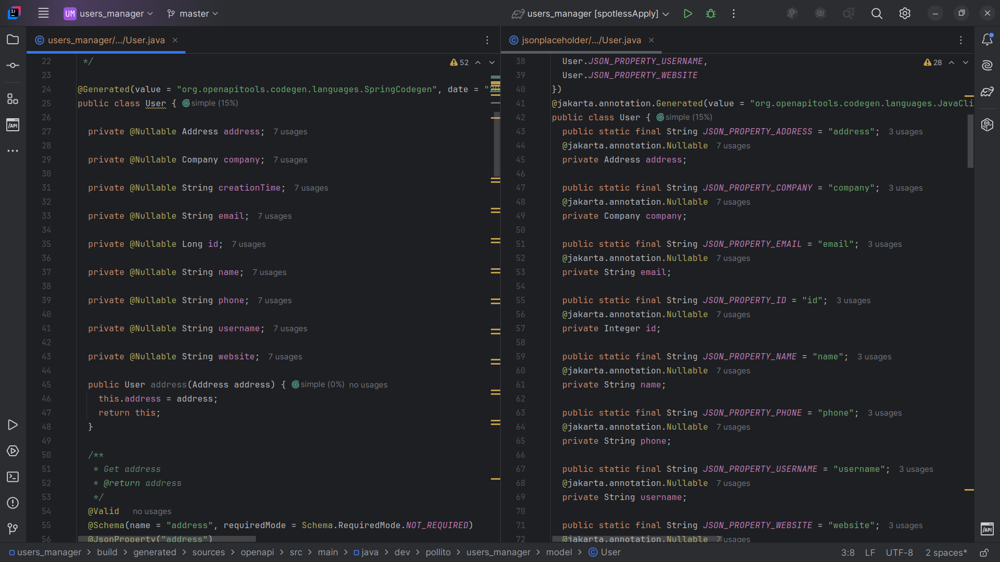

# Use The Generated Feign Client API

In `src/main/java/dev/pollito/users_manager/service/impl/UserServiceImpl.java`, inject the generated `UserApi` and make a rough implementation. So far the code should look something like this:

```java
package dev.pollito.users_manager.service.impl;

import com.typicode.jsonplaceholder.api.UserApi;
import dev.pollito.users_manager.model.User;
import dev.pollito.users_manager.model.Users;
import dev.pollito.users_manager.service.UserService;
import java.util.List;
import java.util.NoSuchElementException;
import lombok.RequiredArgsConstructor;
import org.springframework.stereotype.Service;

@Service
@RequiredArgsConstructor
public class UserServiceImpl implements UserService {

  private final UserApi userApi;

  @Override
  public Users findAll(Integer pageNumber, Integer pageSize, List<String> pageSort, String q) {
    return new Users().content(userApi.getUsers());
  }

  @Override
  public User findById(Long id) {
    return userApi.getUsers().stream()
        .filter(user -> user.getId().equals(id.intValue()))
        .findFirst()
        .orElseThrow(NoSuchElementException::new);
  }
}
```

Your IDE should be throwing two errors:

```log
Required type: List <dev.pollito.users_manager.model.User>
Provided: List <com.typicode.jsonplaceholder.model.User>
```

```log
Required type: dev.pollito.users_manager.model.User
Provided: com.typicode.jsonplaceholder.model.User
```

When checking those files, you realize they are basically are very similar:



* The one on the left is `build/generated/sources/openapi/src/main/java/dev/pollito/users_manager/model/User.java`, and was generated by the `build.gradle` task `openApiGenerate`
* The one on the right is `build/generated/sources/openapi/src/main/java/com/typicode/jsonplaceholder/model/User.java`, and was generated by the `build.gradle` task `openApiGenerateFeign_jsonplaceholder`

So indeed they are not the same class, but why has to be this way? What can we do now?

## Keep The API Integration Layer Distinct From The Controller Layer

Let’s imagine that we are not using the [openapi-generator plugin](https://github.com/OpenAPITools/openapi-generator), and instead we are writing our own DTOs by hand. Here’s a list of reasons why using the same class for both mapping the Feign Client API response and `@RestController` return is a bad idea:

* If you use the same DTO for both, any changes in the external API (new fields, deprecated fields, etc.) might unnecessarily impact your internal code.
* Using a `@RestController` specific DTO lets you filter and tailor the response to only expose what’s truly needed.
  * This prevents leaking sensitive or irrelevant information and helps reduce payload size, improving performance.
* External API DTOs often need to map data formats or structures that are not directly useful to your application.
  * For example, a 3rd party API might return dates as strings, but internally you might want to work with LocalDate.

By having separate DTOs, the codebase becomes easier to test and maintain. Changes to external services won’t directly affect your core application’s functionality.

## Mapstruct

Imagine a big project with few dozens APIs, and hundreds of Schemas -> DTO conversions... Doing this manually can quickly create much boilerplate code and consume a lot of time. Luckily for us, there are multiple object mapping frameworks for Java.

Mappers are a [“choose your own adventure”](https://www.baeldung.com/java-performance-mapping-frameworks) situation. The one I recommend is [MapStruct](https://mapstruct.org/).

1. We need [MapStruct Core](https://mvnrepository.com/artifact/org.mapstruct/mapstruct), [MapStruct Processor](https://mvnrepository.com/artifact/org.mapstruct/mapstruct-processor), and [Lombok Mapstruct Binding](https://mvnrepository.com/artifact/org.projectlombok/lombok-mapstruct-binding) dependencies. In your `build.gradle`, add the dependencies in the `dependencies` section:

    ```groovy
    implementation 'org.mapstruct:mapstruct:1.6.3'
    annotationProcessor 'org.mapstruct:mapstruct-processor:1.6.3'
    annotationProcessor 'org.projectlombok:lombok-mapstruct-binding:0.2.0'
    ```

2. In `src/main/java/dev/pollito/users_manager/mapper`, create `UserMapper.java`, a `@Mapper` interface that maps jsonplaceholder’s users into our own `dev/pollito/users_manager/model/User` users.

    ```java
    package dev.pollito.users_manager.mapper;
    
    import static org.mapstruct.MappingConstants.ComponentModel.SPRING;
    
    import dev.pollito.users_manager.model.User;
    import java.util.List;
    import org.mapstruct.Mapper;
    
    @Mapper(componentModel = SPRING)
    public interface UserMapper {
      User map(com.typicode.jsonplaceholder.model.User user);
    
      List<User> map(List<com.typicode.jsonplaceholder.model.User> users);
    }
    ```
   
3. Inject `UserMapper` in `UserServiceImpl` and solve the errors. So far the code should look something like this:

    ```java
    package dev.pollito.users_manager.service.impl;
    
    import com.typicode.jsonplaceholder.api.UserApi;
    import dev.pollito.users_manager.mapper.UserMapper;
    import dev.pollito.users_manager.model.User;
    import dev.pollito.users_manager.model.Users;
    import dev.pollito.users_manager.service.UserService;
    import java.util.List;
    import java.util.Objects;
    import lombok.RequiredArgsConstructor;
    import org.springframework.stereotype.Service;
    
    @Service
    @RequiredArgsConstructor
    public class UserServiceImpl implements UserService {
    
      private final UserApi userApi;
      private final UserMapper userMapper;
    
      @Override
      public Users findAll(Integer pageNumber, Integer pageSize, List<String> pageSort, String q) {
        return new Users().content(userMapper.map(userApi.getUsers()));
      }
    
      @Override
      public User findById(Long id) {
        return userMapper.map(
            userApi.getUsers().stream()
                .filter(u -> Objects.nonNull(u.getId()))
                .filter(u -> u.getId() == id.intValue())
                .findFirst()
                .orElseThrow());
      }
    }
    ```

Commit the progress so far.

```bash
git add .
git commit -m "mapstruct"
```