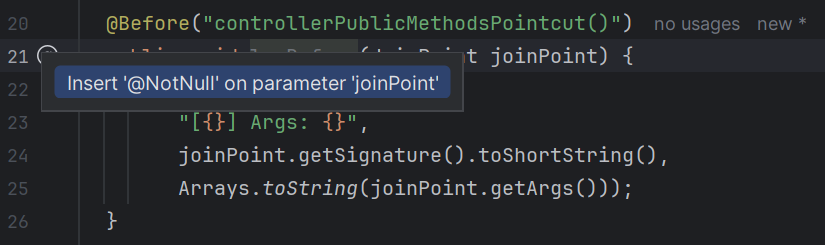
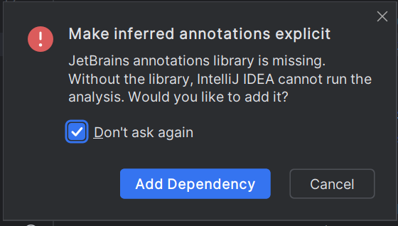
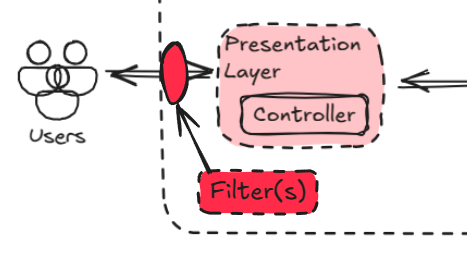

# Logs

Considering we don’t mind printing sensitive information (keys, passwords, etc.), I’ve found useful to log:

* Everything that comes in.
* Everything that comes out.

To achieve that we are going to be using:

* An [Aspect](https://www.baeldung.com/spring-aop) that logs before and after execution of public controller methods.
* [Micrometer](https://www.baeldung.com/micrometer) to enhance logs.
* A [Filter](https://www.baeldung.com/spring-boot-add-filter) interface that logs stuff that doesn’t reach the controllers.

## Aspect

An aspect is a piece of code with a specific task—in this case, logging—that can automatically run at certain points in your application. It lets you separate common behavior from your main business logic, which simplifies the code and keeps it cleaner.

1. We need the [aspectjtools](https://mvnrepository.com/artifact/org.aspectj/aspectjtools) dependency. In your `build.gradle`, **add the dependency** in the `dependencies` section:
    
   ```gradle
    implementation 'org.aspectj:aspectjtools:1.9.22.1'
    ```
   
2. In `src/main/java/dev/pollito/users_manager/aspect`, create `LogAspect.java`.
    
   ```java
    package dev.pollito.users_manager.aspect;
    
    import java.util.Arrays;
    import lombok.extern.slf4j.Slf4j;
    import org.aspectj.lang.JoinPoint;
    import org.aspectj.lang.annotation.AfterReturning;
    import org.aspectj.lang.annotation.Aspect;
    import org.aspectj.lang.annotation.Before;
    import org.aspectj.lang.annotation.Pointcut;
    import org.springframework.stereotype.Component;
    
    @Aspect
    @Component
    @Slf4j
    public class LogAspect {
    
      @Pointcut("execution(public * dev.pollito.users_manager.controller..*.*(..))")
      public void controllerPublicMethodsPointcut() {}
    
      @Before("controllerPublicMethodsPointcut()")
      public void logBefore(JoinPoint joinPoint) {
        log.info(
            "[{}] Args: {}",
            joinPoint.getSignature().toShortString(),
            Arrays.toString(joinPoint.getArgs()));
      }
    
      @AfterReturning(pointcut = "controllerPublicMethodsPointcut()", returning = "result")
      public void logAfterReturning(JoinPoint joinPoint, Object result) {
        log.info("[{}] Response: {}", joinPoint.getSignature().toShortString(), result);
      }
    }
    ```

Rebuild the application. Then go to [http://localhost:8080/users](http://localhost:8080/users) and check the logs. You should find something like this:

```log
2025-03-10T11:44:23.697Z  INFO 16164 --- [users_manager] [nio-8080-exec-1] d.p.users_manager.aspect.LogAspect       : [UserController.getUsers()] Args: []
2025-03-10T11:44:23.697Z  INFO 16164 --- [users_manager] [nio-8080-exec-1] d.p.users_manager.aspect.LogAspect       : [UserController.getUsers()] Response: [User(id=1, name=Leanne Graham, username=Bret, email=Sincere@april.biz)]
```

## What Does The IntelliJ IDEA Suggestion “Insert ‘@NotNull’ on parameter” Mean?

If you’re using IntelliJ IDEA, you would notice that in the class we just created you are being suggested the following:



This annotation indicates that the parameter should not be null when the method is called. It helps in avoiding `NullPointerException` and improves code readability and safety by explicitly specifying that null values are not allowed.

It is not mandatory to add the `@NotNull` annotation, but it is highly recommended:

* **Code Safety**: It helps prevent `NullPointerException` by explicitly specifying that the parameter should not be null.
* **Code Readability**: It makes the code more readable and self-documenting by clearly indicating that null values are not allowed.
* **Static Analysis**: Tools like IntelliJ IDEA can use this annotation to provide better static analysis, warnings, and code suggestions.

When accepting the suggestion, we are going to be notified about a new dependency being added. Just accept.



Sometimes the IDE behaves weird and doesn’t add the dependency in the  build.gradle dependencies section. Go check if you can find the following

```gradle
implementation 'org.jetbrains:annotations:26.0.2'
```

If not, add it.

Rebuild the application. Then go to [http://localhost:8080/users](http://localhost:8080/users) and check the logs. Everything should be working exactly the same as before.

## Micrometer

Imagine this application has many endpoints, and also has many users making requests at the same time. **How are we going to be sure which logs are related to the same request**, when everything is happening at the same time (or very close enough to mix each other)?

**Micrometer** enriches your logs by automatically attaching contextual information. This means that logs include details like [trace and span identifiers](https://medium.com/dzerolabs/observability-journey-understanding-logs-events-traces-and-spans-836524d63172), helping to correlate log messages with specific events and requests across your application.

We need the micrometer dependencies. In your `build.gradle`, **add the dependencies** in the `dependencies` section:

```gradle
implementation 'io.micrometer:micrometer-observation:1.14.4'
implementation 'io.micrometer:micrometer-tracing-bridge-otel:1.4.3'
```

Rebuild the application. Then go to [http://localhost:8080/users](http://localhost:8080/users) and check the logs. You should find something like this:

```log
2025-03-10T12:09:01.871Z  INFO 20224 --- [users_manager] [nio-8080-exec-3] [6eb73e82add143a3fb540ff6983c2c23-e93a7af466f261d4] d.p.users_manager.aspect.LogAspect       : [UserController.getUsers()] Args: []
2025-03-10T12:09:01.871Z  INFO 20224 --- [users_manager] [nio-8080-exec-3] [6eb73e82add143a3fb540ff6983c2c23-e93a7af466f261d4] d.p.users_manager.aspect.LogAspect       : [UserController.getUsers()] Response: [User(id=1, name=Leanne Graham, username=Bret, email=Sincere@april.biz)]
```

Now **each log has a unique identifier**. If this project for some reason interacted with other projects that also used micrometer, the identifier would propagate, making following requests going across different services even easier.

## Filter

When talking about Spring Boot layers, I used this drawing:


But what if I tell you there’s something in the Spring Boot App that goes before the Presentation Layer? These are **Filters**.



A Filter acts like a checkpoint for every incoming request and outgoing response, even before they reach your controllers or after they leave. Think of it as a gatekeeper that can observe—and optionally modify—the raw flow of data between the client and your application.

While aspects log activity around specific controller methods, **filters operate at a lower level, intercepting all HTTP traffic regardless of whether it eventually triggers controller logic**. This makes filters uniquely valuable for logging requests that never make it to your business code.

By integrating a custom log filter, you ensure that nothing slips through the cracks in your logs:

* Every incoming request gets timestamped, inspected, and logged at the "front door," and every outgoing response is documented on its way out.
* This provides a complete audit trail, even for edge cases that don’t trigger your application’s core logic.

Let’s create a log filter: In `src/main/java/dev/pollito/users_manager/filter`, create `LogFilter.java`.

```java
package dev.pollito.users_manager.filter;

import jakarta.servlet.Filter;
import jakarta.servlet.FilterChain;
import jakarta.servlet.ServletException;
import jakarta.servlet.ServletRequest;
import jakarta.servlet.ServletResponse;
import jakarta.servlet.http.HttpServletRequest;
import jakarta.servlet.http.HttpServletResponse;
import java.io.IOException;
import java.util.Enumeration;
import lombok.extern.slf4j.Slf4j;
import org.jetbrains.annotations.NotNull;
import org.springframework.stereotype.Component;

@Component
@Slf4j
public class LogFilter implements Filter {

  @Override
  public void doFilter(
      ServletRequest servletRequest,
      ServletResponse servletResponse,
      @NotNull FilterChain filterChain)
      throws IOException, ServletException {
    logRequestDetails((HttpServletRequest) servletRequest);
    filterChain.doFilter(servletRequest, servletResponse);
    logResponseDetails((HttpServletResponse) servletResponse);
  }

  private void logRequestDetails(@NotNull HttpServletRequest request) {
    log.info(
        ">>>> Method: {}; URI: {}; QueryString: {}; Headers: {}",
        request.getMethod(),
        request.getRequestURI(),
        request.getQueryString(),
        headersToString(request));
  }

  public String headersToString(@NotNull HttpServletRequest request) {
    Enumeration<String> headerNames = request.getHeaderNames();
    StringBuilder stringBuilder = new StringBuilder("{");

    while (headerNames.hasMoreElements()) {
      String headerName = headerNames.nextElement();
      String headerValue = request.getHeader(headerName);

      stringBuilder.append(headerName).append(": ").append(headerValue);

      if (headerNames.hasMoreElements()) {
        stringBuilder.append(", ");
      }
    }

    stringBuilder.append("}");
    return stringBuilder.toString();
  }

  private void logResponseDetails(@NotNull HttpServletResponse response) {
    log.info("<<<< Response Status: {}", response.getStatus());
  }
}
```

Rebuild the application. Then go to [http://localhost:8080/users](http://localhost:8080/users) and check the logs. You should find something resembling this structure:

* `LogFilter` printing the request information such as Method, URI, Headers.
* `LogAspect` printing the controller method and arguments.
* `LogAspect` printing the controller method and response.
* `LogFIlter` printing the response status.

```log
2025-03-14T12:29:36.131Z  INFO 27445 --- [users_manager] [nio-8080-exec-2] [ea1c95d66921506b9bfdf8c7d1b73765-d7cf4980f5c2d9da] d.p.users_manager.filter.LogFilter       : >>>> Method: GET; URI: /users; QueryString: null; Headers: {host: localhost:8080, connection: keep-alive, cache-control: max-age=0, sec-ch-ua: "Chromium";v="134", "Not:A-Brand";v="24", "Google Chrome";v="134", sec-ch-ua-mobile: ?0, sec-ch-ua-platform: "Linux", upgrade-insecure-requests: 1, user-agent: Mozilla/5.0 (X11; Linux x86_64) AppleWebKit/537.36 (KHTML, like Gecko) Chrome/134.0.0.0 Safari/537.36, accept: text/html,application/xhtml+xml,application/xml;q=0.9,image/avif,image/webp,image/apng,*/*;q=0.8,application/signed-exchange;v=b3;q=0.7, sec-fetch-site: cross-site, sec-fetch-mode: navigate, sec-fetch-user: ?1, sec-fetch-dest: document, accept-encoding: gzip, deflate, br, zstd, accept-language: es-ES,es;q=0.9,en;q=0.8}
2025-03-14T12:29:36.134Z  INFO 27445 --- [users_manager] [nio-8080-exec-2] [ea1c95d66921506b9bfdf8c7d1b73765-d7cf4980f5c2d9da] d.p.users_manager.aspect.LogAspect       : [UserController.getUsers()] Args: []
2025-03-14T12:29:36.135Z  INFO 27445 --- [users_manager] [nio-8080-exec-2] [ea1c95d66921506b9bfdf8c7d1b73765-d7cf4980f5c2d9da] d.p.users_manager.aspect.LogAspect       : [UserController.getUsers()] Response: [User(id=1, name=Leanne Graham, username=Bret, email=Sincere@april.biz)]
2025-03-14T12:29:36.138Z  INFO 27445 --- [users_manager] [nio-8080-exec-2] [ea1c95d66921506b9bfdf8c7d1b73765-d7cf4980f5c2d9da] d.p.users_manager.filter.LogFilter       : <<<< Response Status: 200
```

If we visit an uri that doesn't exist (like [http://localhost:8080/asdasd](http://localhost:8080/asdasd)), `LogFilter` will be the one that will let us know in the logs that this request ever happened.

```log
2025-03-14T12:53:52.443Z  INFO 30172 --- [users_manager] [nio-8080-exec-1] [29233a50dd093491acbeaf0fb8020f2a-e8a3e4ad035bfbac] d.p.users_manager.filter.LogFilter       : >>>> Method: GET; URI: /asdasd; QueryString: null; Headers: {host: localhost:8080, connection: keep-alive, sec-ch-ua: "Chromium";v="134", "Not:A-Brand";v="24", "Google Chrome";v="134", sec-ch-ua-mobile: ?0, sec-ch-ua-platform: "Linux", upgrade-insecure-requests: 1, user-agent: Mozilla/5.0 (X11; Linux x86_64) AppleWebKit/537.36 (KHTML, like Gecko) Chrome/134.0.0.0 Safari/537.36, accept: text/html,application/xhtml+xml,application/xml;q=0.9,image/avif,image/webp,image/apng,*/*;q=0.8,application/signed-exchange;v=b3;q=0.7, sec-fetch-site: cross-site, sec-fetch-mode: navigate, sec-fetch-user: ?1, sec-fetch-dest: document, accept-encoding: gzip, deflate, br, zstd, accept-language: es-ES,es;q=0.9,en;q=0.8}
2025-03-14T12:53:52.497Z  INFO 30172 --- [users_manager] [nio-8080-exec-1] [29233a50dd093491acbeaf0fb8020f2a-e8a3e4ad035bfbac] d.p.users_manager.filter.LogFilter       : <<<< Response Status: 404
```

As always, commit the progress so far.

```bash
git add .
git commit -m "logs"
```