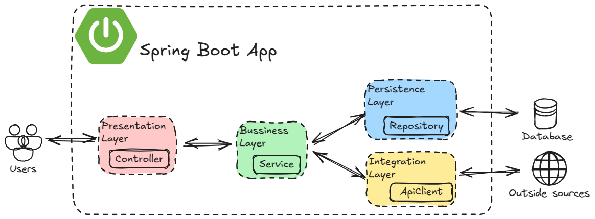

# JpaRepository

Let's check once more the Spring Boot Layers diagram and focus in the **Persistence Layer** (blue box upper right):

## Understanding the Repository Pattern

The [Repository pattern](https://www.geeksforgeeks.org/repository-design-pattern/) is like having a smart librarian for your application's data. Just as a librarian knows how to find, shelve, update, and remove books without you needing to understand the library's organizational system, a repository handles all the data access operations without your business logic needing to know database details.

Think of it as a bridge between your application and your data storage. Your application asks for what it wants in its own language, and the repository translates those requests into database operations.

## What Is JpaRepository?

[JpaRepository](https://www.baeldung.com/the-persistence-layer-with-spring-data-jpa) is Spring's implementation of this pattern for SQL databases. It's like getting a pre-trained librarian who already knows how to perform common operations with minimal instruction.

When you use `JpaRepository`, you're getting:

- A collection of ready-to-use methods for common database operations (finding, saving, updating, deleting).
- Database-agnostic functionality that works across different SQL databases.
- A consistent way to interact with your data regardless of the underlying database.

### How It Works

1. **Your business logic** (the service layer) asks for data: "I need all active users"
2. **The repository** translates this request: `SELECT * FROM users WHERE status = 'active'`
3. **The database** executes the query and returns raw data
4. **The repository** transforms that data back into objects your application understands

### Why JpaRepository Makes Life Easier

Without `JpaRepository`, you'd need to:

- Write SQL queries manually.
- Handle database connections.
- Map database results to your Java objects.
- Manage transactions.
- Deal with database-specific quirks.

`JpaRepository` handles all of this for you. It's like having an experienced translator who speaks both your application's language and the database's language fluently.

### Beyond the Basics

`JpaRepository` isn't just about simple CRUD operations. It also provides:

- Pagination and sorting capabilities.
- Dynamic query generation from method names.
- Custom query support when you need more complex operations.
- Transaction management.

By using `JpaRepository`, you keep your persistence concerns separate from your business logic, making your code more maintainable, testable, and easier to understand.