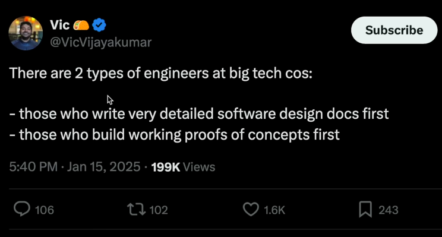

import YouTube from '@site/src/components/YouTube';

# Working in Big Tech is Bad

## Over-Planning

Theo’s video “Build first, plan second” is the perfect starting point.

<YouTube id="rosMfs3pZ_0" />

That video show us the following tweet capture:

When teams prioritize theoretical documentation over tangible prototypes, they risk:

* **Complexity Hallucination**: The engineers on charge (that most probably haven’t written a single line of code in years) create solutions without hands-on experience, leading to bloated designs.
* **Stagnant Innovation**: Documents become gospel, discouraging iteration.
* **Misaligned User Needs**: Without early user engagement, teams build solutions in a vacuum.

Design docs aren’t evil—they’re tools. But when wielded too early, they anchor teams to untested ideas. Building first ground decisions in reality.

## Neglecting Code Quality

The rush to deliver often sidelines code health, breeding long-term consequences:

* **Technical Debt**: Quick-and-dirty prototypes become legacy systems. A feature that “works” today might crumble under scalability demands.
* **Collaboration Barriers**: Poorly structured code confuses teammates, slowing progress. Imagine inheriting a messy codebase—a silent productivity killer.
* **The Myth of Speed**: Sacrificing quality for speed backfires. Refactoring a fragile system takes longer than building it right the first time.

## Disengagement

The “not my job” mentality—whether from burnout or rigid role definitions—erodes team dynamics:

* **Siloed Innovation**: Developers who stick strictly to tasks may miss cross-team insights.
* **User Disconnect**: If no one owns user feedback, products drift from real needs. Imagine a backend engineer ignoring UX concerns, assuming it’s “the frontend’s problem.”
* **Stifled Growth**: Limiting yourself to role boundaries curbs learning. Software thrives on interdisciplinary curiosity.

## Why Do These Issues Persist?

Because underlying these problems is a culture that often rewards the wrong metrics:

* **Promotions for Paperwork**: Companies value people that write docs and attend meetings over people that write code, incentivizing bureaucracy.
* **Short-Term Wins**: Managers prioritize sprint velocity over sustainable practices, ignoring tech debt.
* **Complacency**: “If it works, why change it?” becomes a mantra, killing innovation.

## The Path Forward

Awareness is the first step. Now that you are aware, you have two paths:

### Engage Beyond Your Role

Theo’s story is a blueprint for this path. At Twitch, he didn’t just “do his job”—he challenged assumptions, built prototypes to expose flawed designs, and reached out to other teams to dismantle unnecessary proposals. His proactivity wasn’t about being a “hero”; it was about refusing to let bureaucracy dictate outcomes.

* **Why it works**: By stepping outside role boundaries, you uncover hidden inefficiencies. Theo’s prototype-first approach cut through theoretical debates, proving that action trumps paperwork.
* **The cost**: This path demands emotional labor. You’ll fight inertia, defend your findings to skeptical stakeholders, and risk burnout.
* **The reward**: Real impact. Theo’s work saved months of wasted effort and aligned products with user needs.

**This path isn’t for everyone**, but it’s how systems improve—if you’re willing to care more than the system expects you to.

### Act Your Wage

Here’s the uncomfortable truth: **clean code doesn’t pay the bills**. I’ve worked with brilliant developers whose codebases are littered with shortcuts. At first, I assumed it was due to inexperience or deadlines. Now, I see the pattern: they’ve learned that polish doesn’t matter.

* **Promotions go to those who ship features, not those who refactor**. Managers rarely notice elegant code—but they always notice delays.
* If your company rewards “done” over “done well,” **why invest extra effort?** The developer who writes unit tests that don’t test anything but improve line coverage is not lazy; is optimizing for survival.
* **Code rots, teams resent each other, and future developers inherit the mess**. But the individual? They protect their time and sanity.

Both paths exist because the industry is broken. Theo’s method thrives in cultures that value outcomes over politics, but those are rare. Meanwhile, “acting your wage” is a symptom of environments where developers are treated as disposable resources.

Your choice depends on:

* How much you love the project.
* What you’re willing to tolerate.
* What you believe you deserve.
