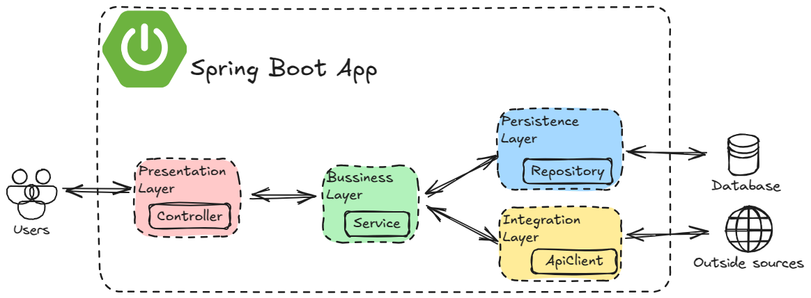

# Spring Boot Layers

Here’s how most Spring Boot projects are organized:

| Layer                              | Responsibility                                                            |
|------------------------------------|---------------------------------------------------------------------------|
| Presentation Layer (`Controllers`) | Handles HTTP requests (routing, input validation), returns HTTP responses |
| Business Layer (`Services`)        | Contains core app logic (calculations, workflows)                         |
| Persistence Layer (`Repositories`) | Manages database interactions                                             |
| Integration Layer (`API Clients`)  | Communicates with external APIs                                           |

A request flow starts with `Controller` → `Service`:

* If you’re fetching data from a database, then `Repository` → `Database`.
* if you’re fetching data from an outside source, then `API Client` → `External API`. 

## Where Do These Names Come From?

These layer names (`Controller`, `Service`, `Repository`) are rooted in:

* **Design Patterns:**
  * [MVC (Model-View-Controller)](https://www.freecodecamp.org/news/model-view-architecture/): A decades-old pattern for separating presentation, logic, and data.
  * [Layered Architecture](https://www.oreilly.com/library/view/software-architecture-patterns/9781491971437/ch01.html): A standard way to isolate concerns (presentation vs. business vs. data).
* **Spring’s Evolution**:
  * Early [Java EE](https://www.geeksforgeeks.org/java-enterprise-edition/) apps used similar layers (like DAOs for data access), which Spring formalized with annotations like `@Controller`, `@Service`, `@Repository`.
* **The names aren’t unique to Spring**—they reflect industry-wide best practices for clean code.]

## Is It Mandatory?

No. **Spring doesn’t enforce these names or layers**. You could write everything in a single class named PizzaManager.java with spaghetti code.

But these conventions solve real problems:

* **Readability**: Developers instantly understand a class named `UserService` vs. `TaxCalculatorUtil`.
* **Tooling**: Annotations like `@Repository` enable Spring to auto-handle database exceptions.
* **Team Alignment**: New hires (or future-you) waste less time deciphering a bespoke structure.

## When to Bend the Rules

* **Small projects might combine layers** (e.g., a `PaymentProcessor` class acting as both service and integration layer).
* **Non-HTTP apps** (e.g., [batch jobs](https://www.ibm.com/think/topics/batch-jobs)) might skip controllers entirely.
* **If your team uses different terms** (e.g., `DataManager` instead of `Repository`), consistency matters more than the name itself.

## Common Practices & Pitfalls

* **One Service Per Controller**: A controller shouldn’t orchestrate 5 services. If it does, your business logic is probably scattered.
* **Layers Are Optional**: No database? Skip the persistence layer. No external APIs? Skip integration. Start simple.
* **Don’t Let Layers Bleed**:
  * **Bad**: Controllers doing business logic, Repositories making API calls.
  * **Good**: Each layer has a single responsibility.
* **Service-to-Service Calls Are Allowed**: Services can call other services (but avoid [circular dependencies](https://www.baeldung.com/circular-dependencies-in-spring)!).