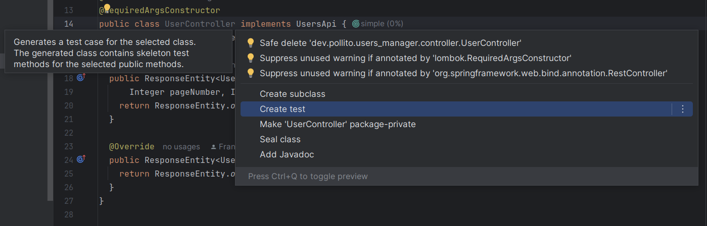
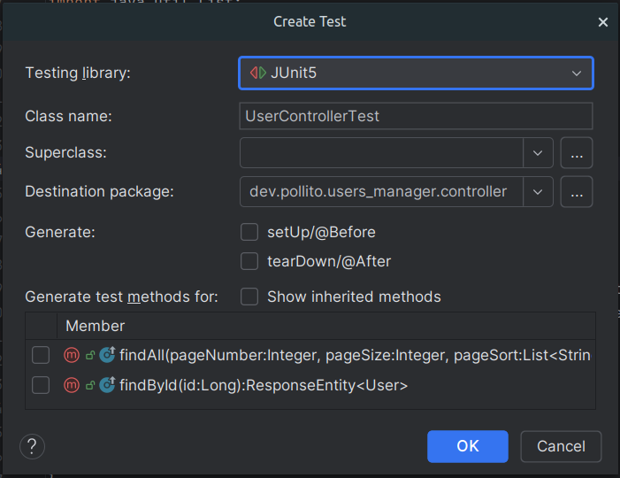
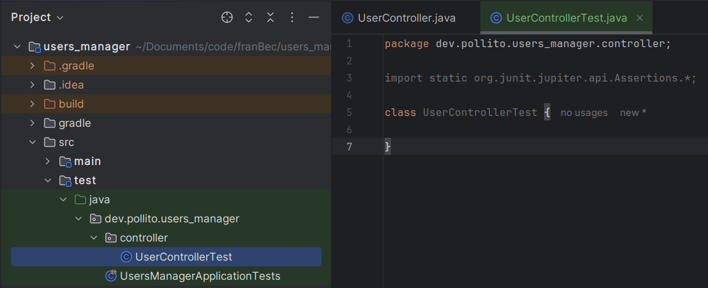
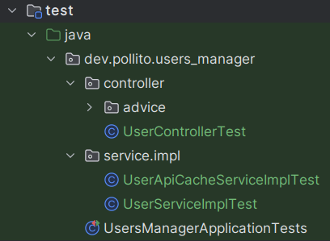

# Let's Write Some Unit Tests

## Create The Test Classes

Go to `src/main/java/dev/pollito/users_manager/controller/UserController.java`, and do `ctrl+intro` on the name of the class. On the pop-up menu, select Create test.



On the next pop-up menu, leave everything as default.



Now you should have a new empty class created in `src/test/java/dev/pollito/users_manager/controller/UserControllerTest.java`.



Repeat this process for `src/main/java/dev/pollito/users_manager/controller/advice/ControllerAdvice.java`, `src/main/java/dev/pollito/users_manager/service/impl/UserApiCacheServiceImpl.java`, and `src/main/java/dev/pollito/users_manager/service/impl/UserServiceImpl.java`. By the end, your test directory should look something like this:



## Write The Tests

There's not one correct way of writing unit tests. Here are the ones I did:

### ControllerAdviceTest.java

`src/test/java/dev/pollito/users_manager/controller/advice/ControllerAdviceTest.java`

```java
package dev.pollito.users_manager.controller.advice;

import exception.JsonPlaceholderException;
import jakarta.validation.ConstraintViolationException;
import org.jetbrains.annotations.Contract;
import org.jetbrains.annotations.NotNull;
import org.junit.jupiter.api.Test;
import org.junit.jupiter.api.extension.ExtendWith;
import org.junit.jupiter.params.ParameterizedTest;
import org.junit.jupiter.params.provider.MethodSource;
import org.mockito.InjectMocks;
import org.mockito.junit.jupiter.MockitoExtension;
import org.springframework.http.HttpStatus;
import org.springframework.http.ProblemDetail;
import org.springframework.web.method.annotation.MethodArgumentTypeMismatchException;
import org.springframework.web.servlet.resource.NoResourceFoundException;

import java.util.NoSuchElementException;
import java.util.stream.Stream;

import static org.junit.jupiter.api.Assertions.*;
import static org.mockito.Mockito.mock;
import static org.mockito.Mockito.when;

@ExtendWith(MockitoExtension.class)
class ControllerAdviceTest {
    @InjectMocks ControllerAdvice controllerAdvice;

    private static void problemDetailAssertions(
            @NotNull ProblemDetail response, @NotNull Exception e, @NotNull HttpStatus httpStatus) {
        assertEquals(httpStatus.value(), response.getStatus());
        assertEquals(e.getClass().getSimpleName(), response.getTitle());
        assertNotNull(response.getProperties());
        assertNotNull(response.getProperties().get("timestamp"));
        assertNotNull(response.getProperties().get("trace"));
    }

    @Test
    void whenNoResourceFoundExceptionThenReturnProblemDetail() {
        NoResourceFoundException e = mock(NoResourceFoundException.class);
        problemDetailAssertions(controllerAdvice.handle(e), e, HttpStatus.NOT_FOUND);
    }

    @Test
    void whenNoSuchElementExceptionThenReturnProblemDetail() {
        NoSuchElementException e = mock(NoSuchElementException.class);
        problemDetailAssertions(controllerAdvice.handle(e), e, HttpStatus.NOT_FOUND);
    }

    @Test
    void whenMethodArgumentTypeMismatchExceptionThenReturnProblemDetail() {
        MethodArgumentTypeMismatchException e = mock(MethodArgumentTypeMismatchException.class);
        problemDetailAssertions(controllerAdvice.handle(e), e, HttpStatus.BAD_REQUEST);
    }

    @Test
    void whenConstraintViolationExceptionThenReturnProblemDetail() {
        ConstraintViolationException e = mock(ConstraintViolationException.class);
        problemDetailAssertions(controllerAdvice.handle(e), e, HttpStatus.BAD_REQUEST);
    }

    @Test
    void whenExceptionThenReturnProblemDetail() {
        Exception e = mock(Exception.class);
        problemDetailAssertions(controllerAdvice.handle(e), e, HttpStatus.INTERNAL_SERVER_ERROR);
    }

    @Contract(pure = true)
    private static @NotNull Stream<HttpStatus> httpStatusProvider() {
        return Stream.of(HttpStatus.BAD_REQUEST, HttpStatus.INTERNAL_SERVER_ERROR);
    }

    @ParameterizedTest
    @MethodSource("httpStatusProvider")
    void whenJsonPlaceholderExceptionThenReturnProblemDetail(@NotNull HttpStatus httpStatus) {
        JsonPlaceholderException e = mock(JsonPlaceholderException.class);
        when(e.getStatus()).thenReturn(httpStatus.value());

        problemDetailAssertions(controllerAdvice.handle(e), e, httpStatus);
    }
}
```

This test class verifies the exception handling in your application. It checks that:

* Each type of exception (`NoResourceFoundException`, `NoSuchElementException`, etc.) is properly translated into appropriate HTTP status codes and problem details.
* The problem details include required properties like timestamp and stack trace.
* `JsonPlaceholderException` handling works with different HTTP statuses (using parameterized tests).
* The test has a helper method to avoid repetitive assertion code.

### UserControllerTest.java

`src/test/java/dev/pollito/users_manager/controller/UserControllerTest.java`

```java
package dev.pollito.users_manager.controller;

import static org.junit.jupiter.api.Assertions.*;
import static org.mockito.ArgumentMatchers.*;
import static org.mockito.Mockito.mock;
import static org.mockito.Mockito.when;

import dev.pollito.users_manager.model.User;
import dev.pollito.users_manager.model.Users;
import dev.pollito.users_manager.service.UserService;
import java.util.Collections;
import org.junit.jupiter.api.Test;
import org.junit.jupiter.api.extension.ExtendWith;
import org.mockito.InjectMocks;
import org.mockito.Mock;
import org.mockito.junit.jupiter.MockitoExtension;
import org.springframework.http.HttpStatus;
import org.springframework.http.ResponseEntity;

@ExtendWith(MockitoExtension.class)
class UserControllerTest {
  @InjectMocks private UserController userController;
  @Mock private UserService userService;

  @Test
  void whenFindAllThenReturnOk() {
    when(userService.findAll(anyInt(), anyInt(), anyList(), anyString()))
        .thenReturn(mock(Users.class));
    ResponseEntity<Users> response = userController.findAll(0, 0, Collections.emptyList(), "");
    assertEquals(HttpStatus.OK, response.getStatusCode());
    assertNotNull(response);
  }

  @Test
  void whenFindByIdThenReturnOK() {
    when(userService.findById(anyLong())).thenReturn(mock(User.class));
    ResponseEntity<User> response = userController.findById(1L);
    assertEquals(HttpStatus.OK, response.getStatusCode());
    assertNotNull(response.getBody());
  }
}
```

This class tests the REST endpoints in your controller, focusing on:

* Verifying that the controller returns HTTP 200 OK responses when successful.
* Testing that both `findAll` and `findById` endpoints return proper responses.
* Mocking the `UserService` to isolate the controller's responsibility.
* Checking response status codes and confirming responses are not null.

### UserApiCacheServiceImplTest.java

`src/test/java/dev/pollito/users_manager/service/impl/UserApiCacheServiceImplTest.java`

```java
package dev.pollito.users_manager.service.impl;

import static org.junit.jupiter.api.Assertions.*;
import static org.mockito.Mockito.mock;
import static org.mockito.Mockito.when;

import com.typicode.jsonplaceholder.api.UserApi;
import com.typicode.jsonplaceholder.model.User;
import java.util.List;
import org.junit.jupiter.api.Test;
import org.junit.jupiter.api.extension.ExtendWith;
import org.mockito.InjectMocks;
import org.mockito.Mock;
import org.mockito.junit.jupiter.MockitoExtension;

@ExtendWith(MockitoExtension.class)
class UserApiCacheServiceImplTest {
  @InjectMocks private UserApiCacheServiceImpl userApiCacheService;
  @Mock private UserApi userApi;

  @Test
  void whenGetUsersThenReturnListOfUsers() {
    when(userApi.getUsers()).thenReturn(List.of(mock(User.class)));
    assertFalse(userApiCacheService.getUsers().isEmpty());
  }
}
```

A simple test that verifies your caching service for the external API:

* Tests that when the external UserApi returns data, your caching service properly returns it.
* Confirms the service transforms API responses into usable data for your application.
* Uses a minimal test approach focusing on just the essential functionality.

### UserServiceImplTest.java

`src/test/java/dev/pollito/users_manager/service/impl/UserServiceImplTest.java`. I put the mocks in a separate utility class `src/test/java/dev/pollito/users_manager/MockData.java`

```java
package dev.pollito.users_manager.service.impl;

import static dev.pollito.users_manager.MockData.USERS;
import static org.junit.jupiter.api.Assertions.*;
import static org.mockito.Mockito.when;

import dev.pollito.users_manager.mapper.UserMapper;
import dev.pollito.users_manager.model.Users;
import dev.pollito.users_manager.service.UserApiCacheService;
import java.util.List;
import java.util.NoSuchElementException;
import org.junit.jupiter.api.BeforeEach;
import org.junit.jupiter.api.Test;
import org.junit.jupiter.api.extension.ExtendWith;
import org.mapstruct.factory.Mappers;
import org.mockito.InjectMocks;
import org.mockito.Mock;
import org.mockito.Spy;
import org.mockito.junit.jupiter.MockitoExtension;

@ExtendWith(MockitoExtension.class)
class UserServiceImplTest {
  @InjectMocks private UserServiceImpl userService;
  @Mock private UserApiCacheService userApiCacheService;

  @SuppressWarnings("unused")
  @Spy
  private UserMapper userMapper = Mappers.getMapper(UserMapper.class);

  @BeforeEach
  void setUp() {
    when(userApiCacheService.getUsers()).thenReturn(USERS);
  }

  @Test()
  void whenGetUsersThenReturnUserList() {
    Users response = userService.findAll(0, 10, null, null);
    assertEquals(10, response.getTotalElements());
    assertNotNull(response.getPageable());
    assertEquals(0, response.getPageable().getPageNumber());
    assertEquals(10, response.getPageable().getPageSize());
    assertEquals(1, response.getContent().getFirst().getId());
    assertEquals(10, response.getContent().getLast().getId());
  }

  @Test()
  void whenGetUsersDescThenReturnUserListDesc() {
    Users response = userService.findAll(0, 10, List.of("id:desc"), null);
    assertEquals(10, response.getContent().getFirst().getId());
    assertEquals(1, response.getContent().getLast().getId());
  }

  @Test
  void whenGetUsersWithQThenReturnSubList() {
    Users lePage0 = userService.findAll(0, 5, null, "le");
    assertEquals(5, lePage0.getContent().size());
    assertEquals(7, lePage0.getTotalElements());

    Users lePage1 = userService.findAll(1, 5, null, "le");
    assertEquals(2, lePage1.getContent().size());
    assertEquals(7, lePage1.getTotalElements());

    Users biz = userService.findAll(0, 10, null, "biz");
    assertEquals(3, biz.getContent().size());
    assertEquals(3, biz.getTotalElements());
  }

  @Test
  void whenSortByPropertyThenReturnSortedList() {
    Users sortByEmail = userService.findAll(0, 10, List.of("email"), null);
    assertEquals("Chaim_McDermott@dana.io", sortByEmail.getContent().getFirst().getEmail());
    assertEquals("Telly.Hoeger@billy.biz", sortByEmail.getContent().getLast().getEmail());

    Users sortByName = userService.findAll(0, 10, List.of("name"), null);
    assertEquals("Chelsey Dietrich", sortByName.getContent().getFirst().getName());
    assertEquals("Patricia Lebsack", sortByName.getContent().getLast().getName());

    Users sortByUsername = userService.findAll(0, 10, List.of("username"), null);
    assertEquals("Antonette", sortByUsername.getContent().getFirst().getUsername());
    assertEquals("Samantha", sortByUsername.getContent().getLast().getUsername());

    Users sortBySamePropertyTwice = userService.findAll(0,10,List.of("id:asc","id:asc"),null);
    assertEquals(1, sortBySamePropertyTwice.getContent().getFirst().getId());
    assertEquals(10, sortBySamePropertyTwice.getContent().getLast().getId());
  }

  @Test
  void whenGetUserThenReturnUser() {
    assertNotNull(userService.findById(1L));
  }

  @Test
  void whenGetUserThatDoesntExistThenThrowException() {
    assertThrows(NoSuchElementException.class, () -> userService.findById(-1L));
  }
}
```

```java
package dev.pollito.users_manager;

import com.typicode.jsonplaceholder.model.User;
import java.util.List;

public class MockData {
  private MockData() {}

  private static final User USER_1 =
      new User().id(1).name("Leanne Graham").username("Bret").email("Sincere@april.biz");

  private static final User USER_2 =
      new User().id(2).name("Ervin Howell").username("Antonette").email("Shanna@melissa.tv");

  private static final User USER_3 =
      new User().id(3).name("Clementine Bauch").username("Samantha").email("Nathan@yesenia.net");

  private static final User USER_4 =
      new User()
          .id(4)
          .name("Patricia Lebsack")
          .username("Karianne")
          .email("Julianne.OConner@kory.org");

  private static final User USER_5 =
      new User()
          .id(5)
          .name("Chelsey Dietrich")
          .username("Kamren")
          .email("Lucio_Hettinger@annie.ca");

  private static final User USER_6 =
      new User()
          .id(6)
          .name("Mrs. Dennis Schulist")
          .username("Leopoldo_Corkery")
          .email("Karley_Dach@jasper.info");

  private static final User USER_7 =
      new User()
          .id(7)
          .name("Kurtis Weissnat")
          .username("Elwyn.Skiles")
          .email("Telly.Hoeger@billy.biz");

  private static final User USER_8 =
      new User()
          .id(8)
          .name("Nicholas Runolfsdottir V")
          .username("Maxime_Nienow")
          .email("Sherwood@rosamond.me");

  private static final User USER_9 =
      new User()
          .id(9)
          .name("Glenna Reichert")
          .username("Delphine")
          .email("Chaim_McDermott@dana.io");

  private static final User USER_10 =
      new User()
          .id(10)
          .name("Clementina DuBuque")
          .username("Moriah.Stanton")
          .email("Rey.Padberg@karina.biz");

  public static final List<User> USERS =
      List.of(USER_1, USER_2, USER_3, USER_4, USER_5, USER_6, USER_7, USER_8, USER_9, USER_10);
}
```

This test class is the most comprehensive test suite that verifies your business logic:

* Tests pagination functionality (page size, page numbers).
* Verifies sorting works (both ascending and descending).
* Tests filtering by query string across user properties.
* Ensures error handling works correctly (throws `NoSuchElementException` for non-existent users).
* Uses a spy on the `MapStruct` mapper to use real mapping functionality while mocking other dependencies.
* Reuses test data from a separate `MockData` class.

Commit the progress so far.

```bash
git add .
git commit -m "unit tests"
```