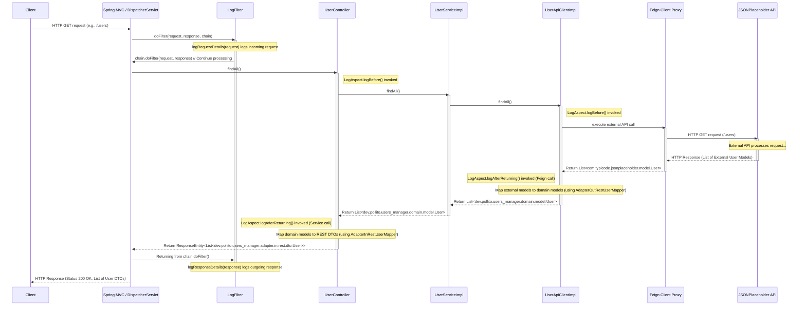

# Configurar la API Feign Client generada

Hasta ahora usamos el [OpenAPI Generator Gradle Plugin](https://github.com/OpenAPITools/openapi-generator/tree/master/modules/openapi-generator-gradle-plugin) para generar la representación de la API externa que queremos integrar.

<div>
  
</div>

Pero todavía no estamos usando nada de ese código en nuestra aplicación. Cambiemos eso.

## Mapper

Convierte entre los modelos de respuesta de la API y los modelos de dominio.

<div>
  
</div>

_Otras carpetas se omiten por simplicidad._

```java title="src/main/java/dev/pollito/users_manager/adapter/out/rest/mapper/AdapterOutRestUserMapper.java"
package dev.pollito.users_manager.adapter.out.rest.mapper;

import static org.mapstruct.MappingConstants.ComponentModel.SPRING;

import dev.pollito.users_manager.domain.model.User;
import org.mapstruct.Mapper;

@Mapper(componentModel = SPRING)
public interface AdapterOutRestUserMapper {
  User map(com.typicode.jsonplaceholder.model.User u);
}
```

### Conflicto de Mapper en el registro de Spring Bean

¿Por qué este mapper tiene un nombre largo (`AdapterOutRestUserMapper`) en lugar de uno simple (como `UserMapper`)? Eso es porque en nuestro proyecto, el nombre `UserMapper` ya está tomado por `src/main/java/dev/pollito/users_manager/adapter/in/rest/mapper/UserMapper.java`.

* Al usar `@Mapper(componentModel = SPRING)`, las implementaciones generadas se registran como Spring beans.
* Spring requiere identificadores de bean únicos, y las clases con el mismo nombre causan conflictos.

Recomendación personal: por consistencia, renombra `src/main/java/dev/pollito/users_manager/adapter/in/rest/mapper/UserMapper.java` a `src/main/java/dev/pollito/users_manager/adapter/in/rest/mapper/AdapterInRestUserMapper.java`.

## Secondary port

Creá un Secondary Port.

<div>
  
</div>

_Otras carpetas se omiten por simplicidad._

```java title="src/main/java/dev/pollito/users_manager/domain/port/out/UserApiClient.java"
package dev.pollito.users_manager.domain.port.out;

import dev.pollito.users_manager.domain.model.User;
import java.util.List;
import java.util.Optional;

public interface UserApiClient {
  List<User> findAll();

  Optional<User> findById(Long id);
}
```

## Secondary adapter (REST)

Creá un adapter que implemente el Secondary Port.

<div>
  
</div>

_Otras carpetas se omiten por simplicidad._

```java title="src/main/java/dev/pollito/users_manager/adapter/out/rest/UserApiClientImpl.java"
package dev.pollito.users_manager.adapter.out.rest;

import com.typicode.jsonplaceholder.api.UserApi;
import dev.pollito.users_manager.adapter.out.rest.mapper.AdapterOutRestUserMapper;
import dev.pollito.users_manager.config.feign.FeignException;
import dev.pollito.users_manager.domain.model.User;
import dev.pollito.users_manager.domain.port.out.UserApiClient;
import java.util.List;
import java.util.Optional;
import lombok.RequiredArgsConstructor;
import org.springframework.http.HttpStatus;
import org.springframework.stereotype.Service;

@Service
@RequiredArgsConstructor
public class UserApiClientImpl implements UserApiClient {
  private final UserApi userApi;
  private final AdapterOutRestUserMapper adapterOutRestUserMapper;

  @Override
  public List<User> findAll() {
    return userApi.findAll().stream().map(adapterOutRestUserMapper::map).toList();
  }

  @Override
  public Optional<User> findById(Long id) {
    try {
      return Optional.of(adapterOutRestUserMapper.map(userApi.findById(id)));
    } catch (FeignException e) {
      if (e.getStatus() == HttpStatus.NOT_FOUND.value()) {
        return Optional.empty();
      }
      throw e;
    }
  }
}
```

## Valor de URL en application.yml

Si a esta altura no renombraste `src/main/resources/application.properties`, renombralo a `src/main/resources/application.yml`.

Luego, agregá la url de la fuente externa que estamos integrando. El resultado debería verse algo así:

```yaml title="src/main/resources/application.yml"
jsonplaceholder:
  baseUrl: https://jsonplaceholder.typicode.com/
spring:
  application:
    name: users_manager
```

* Es importante que el nombre de las claves raíz (en este ejemplo particular, `jsonplaceholder`) esté todo en **minúsculas**.
  * Si no, más tarde te saldrá el error `Prefix must be in canonical form`.
* El orden en este archivo no importa. A mí me gusta tener las cosas ordenadas alfabéticamente.

## Configuration Properties

Para acceder a la url definida en `src/main/resources/application.yml`, vamos a usar una clase [ConfigurationProperties](https://www.baeldung.com/configuration-properties-in-spring-boot).

* Hay otras formas de acceder a una propiedad de configuración externalizada. La más común que veo por todos lados es usando [la anotación @Value](https://www.baeldung.com/spring-value-annotation). No la recomiendo mucho porque al hacer unit testing, terminas usando [Reflection](https://stackoverflow.com/questions/2811141/is-it-bad-practice-to-use-reflection-in-unit-testing), lo cual se ve como mala práctica.

```java title="src/main/java/dev/pollito/users_manager/config/feign/jsonplaceholder/JsonPlaceholderConfigProperties.java"
package dev.pollito.users_manager.config.feign.jsonplaceholder;

import lombok.Data;
import org.springframework.boot.context.properties.ConfigurationProperties;
import org.springframework.context.annotation.Configuration;

@Configuration
@ConfigurationProperties(prefix = "jsonplaceholder")
@Data
public class JsonPlaceholderConfigProperties {
  private String baseUrl;
}
```

## Configuración del Api Client

Creá una clase de configuración que:

* Lea la URL base de application.yml
* Configure el ApiClient
* Registre el ErrorDecoder

```java title="src/main/java/dev/pollito/users_manager/config/feign/jsonplaceholder/JsonPlaceholderApiConfig.java"
package dev.pollito.users_manager.config.feign.jsonplaceholder;

import com.typicode.jsonplaceholder.ApiClient;
import com.typicode.jsonplaceholder.api.UserApi;
import lombok.RequiredArgsConstructor;
import org.jetbrains.annotations.NotNull;
import org.springframework.context.annotation.Bean;
import org.springframework.context.annotation.Configuration;

@Configuration
@RequiredArgsConstructor
public class JsonPlaceholderApiConfig {
  private final JsonPlaceholderConfigProperties jsonPlaceholderConfigProperties;
  private final JsonPlaceholderErrorDecoder jsonPlaceholderErrorDecoder;

  @Bean
  public ApiClient apiClient() {
    ApiClient apiClient = new ApiClient();
    apiClient.setBasePath(jsonPlaceholderConfigProperties.getBaseUrl());
    apiClient.setFeignBuilder(
        apiClient.getFeignBuilder().errorDecoder(jsonPlaceholderErrorDecoder));

    return apiClient;
  }

  @Bean
  public UserApi userApi(@NotNull ApiClient apiClient) {
    return apiClient.buildClient(UserApi.class);
  }
}
```

## Usar el Secondary Port

Modificá `UserServiceImpl` para que la aplicación use el cliente API.

<div>
  
</div>

_Otras carpetas se omiten por simplicidad._

```java title="src/main/java/dev/pollito/users_manager/domain/service/UserServiceImpl.java"
package dev.pollito.users_manager.domain.service;

import dev.pollito.users_manager.domain.model.User;
import dev.pollito.users_manager.domain.port.in.UserService;
import dev.pollito.users_manager.domain.port.out.UserApiClient;
import java.util.List;
import lombok.RequiredArgsConstructor;
import org.springframework.stereotype.Service;

@Service
@RequiredArgsConstructor
public class UserServiceImpl implements UserService {
  private final UserApiClient userApiClient;

  @Override
  public List<User> findAll() {
    return userApiClient.findAll();
  }

  @Override
  public User findById(Long id) {
    return userApiClient.findById(id).orElseThrow();
  }
}
```

## Ejecutá la aplicación

Hacé clic derecho en la clase principal → Run. Luego andá a [http://localhost:8080/users](http://localhost:8080/users).



1.  **El cliente inicia la petición:** Un cliente externo hace una petición HTTP GET al endpoint de listado de usuarios de la aplicación.
2.  **Spring MVC y filtros:** La petición llega al `DispatcherServlet` de Spring y pasa por el `LogFilter`, que loguea los detalles de la petición entrante antes de permitir que el procesamiento continúe.
3.  **Enrutando al controlador:** Spring MVC enruta la petición al `UserController`, específicamente al método `findAll()`. El `LogAspect` loguea la entrada a este método del controlador.
4.  **El controlador invoca al servicio:** El método `findAll()` del `UserController` delega la petición a la implementación de la interfaz `UserService` (`UserServiceImpl`).
5.  **El servicio invoca al adaptador:** El método `findAll()` del `UserServiceImpl` delega la petición a la implementación de la interfaz `UserApiClient` (`UserApiClientImpl`).
6.  **El adaptador llama a la API externa vía Feign:** El método `findAll()` del `UserApiClientImpl` llama a `userApi.findAll()`. `userApi` es un proxy de cliente Feign que manda una petición HTTP GET a la API externa JSONPlaceholder. El `LogAspect` loguea la entrada a esta llamada a la API externa vía Feign.
7.  **La API externa responde:** La API JSONPlaceholder procesa la petición y devuelve una respuesta HTTP que contiene una lista de usuarios en su formato específico.
8.  **El cliente Feign maneja la respuesta:** El cliente Feign recibe la respuesta, la deserializa, y devuelve una lista de modelos de usuario externos al `UserApiClientImpl`. El `LogAspect` loguea la respuesta de la llamada a Feign.
9.  **El adaptador mapea modelos:** *Dentro* del `UserApiClientImpl`, la lista de modelos de usuario externos que volvió es mapeada al modelo de dominio de la aplicación (`dev.pollito.users_manager.domain.model.User`) usando el `AdapterOutRestUserMapper`.
10. **El adaptador vuelve al aervicio:** El `UserApiClientImpl` devuelve la lista de modelos de usuario de dominio al `UserServiceImpl`.
11. **El servicio vuelve al controlador:** El `UserServiceImpl` devuelve la lista de modelos de usuario de dominio al `UserController`.
12. **El controlador mapea modelos:** *Dentro* del `UserController`, la lista de modelos de usuario de dominio es mapeada al formato DTO de REST (`dev.pollito.users_manager.adapter.in.rest.dto.User`) que se usa para la respuesta de la API, usando el `AdapterInRestUserMapper`.
13. **El controlador devuelve la entidad de respuesta:** El `UserController` envuelve la lista de DTOs en un `ResponseEntity.ok()` y lo devuelve a Spring. El `LogAspect` loguea la respuesta del método del controlador.
14. **Spring MVC y filtros manejan la respuesta:** Spring MVC procesa el `ResponseEntity`. La respuesta vuelve a pasar por el `LogFilter`, que loguea los detalles de la respuesta de salida.
15. **Respuesta enviada al cliente:** Spring manda la respuesta HTTP final al cliente.

<div>
  
</div>

¡Felicidades! Tu app Spring Boot está lista, funcionando y obteniendo información de una fuente externa.

Commiteá el progreso hasta ahora.

```bash
git add .
git commit -m "usando código de secondary adapter api externa generado a partir de una openapi specification"
```

## Próximos pasos

Acá tenés algo de tarea para vos:

### Crear los dominios de aplicación faltantes

Creá los dominios de aplicación faltantes **Address**, **Company** y **Geo**. De esta manera, la información obtenida del Secondary Adapter aparecerá en la respuesta de la aplicación.

```java title="src/main/java/dev/pollito/users_manager/domain/model/Address.java"
package dev.pollito.users_manager.domain.model;

import static lombok.AccessLevel.PRIVATE;

import lombok.Data;
import lombok.experimental.FieldDefaults;

@Data
@FieldDefaults(level = PRIVATE)
public class Address {
  String city;
  Geo geo;
  String street;
  String suite;
  String zipcode;
}
```

```java title="src/main/java/dev/pollito/users_manager/domain/model/Company.java"
package dev.pollito.users_manager.domain.model;

import static lombok.AccessLevel.PRIVATE;

import lombok.Data;
import lombok.experimental.FieldDefaults;

@Data
@FieldDefaults(level = PRIVATE)
public class Company {
  String bs;
  String catchPhrase;
  String name;
}
```

```java title="src/main/java/dev/pollito/users_manager/domain/model/Geo.java"
package dev.pollito.users_manager.domain.model;

import static lombok.AccessLevel.PRIVATE;

import lombok.Data;
import lombok.experimental.FieldDefaults;

@Data
@FieldDefaults(level = PRIVATE)
public class Geo {
  String lat;
  String lng;
}
```

Actualizá `User`.

```java title="src/main/java/dev/pollito/users_manager/domain/model/User.java"
package dev.pollito.users_manager.domain.model;

import static lombok.AccessLevel.PRIVATE;

import lombok.Data;
import lombok.experimental.FieldDefaults;

@Data
@FieldDefaults(level = PRIVATE)
public class User {
  Long id;
  String name;
  String username;
  String email;
  String phone;
  String profilePictureUrl;
  String website;
  Address address;
  Company company;
}
```

### Extender el logging aspect

Extendé el logging aspect para cubrir métodos en la API de jsonPlaceholder.

```java title="src/main/java/dev/pollito/users_manager/config/aspect/LogAspect.java"
package dev.pollito.users_manager.config.aspect;

import java.util.Arrays;
import lombok.extern.slf4j.Slf4j;
import org.aspectj.lang.JoinPoint;
import org.aspectj.lang.annotation.AfterReturning;
import org.aspectj.lang.annotation.Aspect;
import org.aspectj.lang.annotation.Before;
import org.aspectj.lang.annotation.Pointcut;
import org.jetbrains.annotations.NotNull;
import org.springframework.stereotype.Component;

@Aspect
@Component
@Slf4j
public class LogAspect {
  @Pointcut("execution(public * dev.pollito.users_manager.adapter.in.rest..*Controller.*(..))")
  public void controllerPublicMethodsPointcut() {}

  @Pointcut("execution(public * com.typicode.jsonplaceholder.api.*.*(..))")
  public void jsonPlaceholderApiMethodsPointcut() {}

  @Before("controllerPublicMethodsPointcut() || jsonPlaceholderApiMethodsPointcut()")
  public void logBefore(@NotNull JoinPoint joinPoint) {
    log.info(
        "[{}] Args: {}",
        joinPoint.getSignature().toShortString(),
        Arrays.toString(joinPoint.getArgs()));
  }

  @AfterReturning(
          pointcut = "controllerPublicMethodsPointcut() || jsonPlaceholderApiMethodsPointcut()",
          returning = "result")
  public void logAfterReturning(@NotNull JoinPoint joinPoint, Object result) {
    log.info("[{}] Response: {}", joinPoint.getSignature().toShortString(), result);
  }
}
```

### Actualizar los unit tests

Si querés que el mutation testing se aplique a la clase `UserApiClientImpl` recién creada, tenés que agregar su ubicación a la configuración de `pitest` en `build.gradle`.

```groovy title="build.gradle"
pitest {
    junit5PluginVersion = '1.2.1'
    outputFormats = ['HTML']
    targetClasses = [
        "${project.group}.${project.name}.adapter.in.rest.*".toString(),
        "${project.group}.${project.name}.adapter.out.rest.*".toString(),
        "${project.group}.${project.name}.config.advice.*".toString(),
        "${project.group}.${project.name}.domain.service.*".toString(),
    ]
    excludedClasses = [
        // excluir todos los subpaquetes en adapter.in.rest, como mappers y código generado por openApi
        "${project.group}.${project.name}.adapter.in.rest.*.*".toString(),
        // excluir todos los subpaquetes en adapter.out.rest, como mappers
        "${project.group}.${project.name}.adapter.out.rest.*.*".toString()
    ]
    targetTests = [
        "${project.group}.${project.name}.*".toString()
    ]
    timestampedReports = false
    useClasspathFile = true
}
```