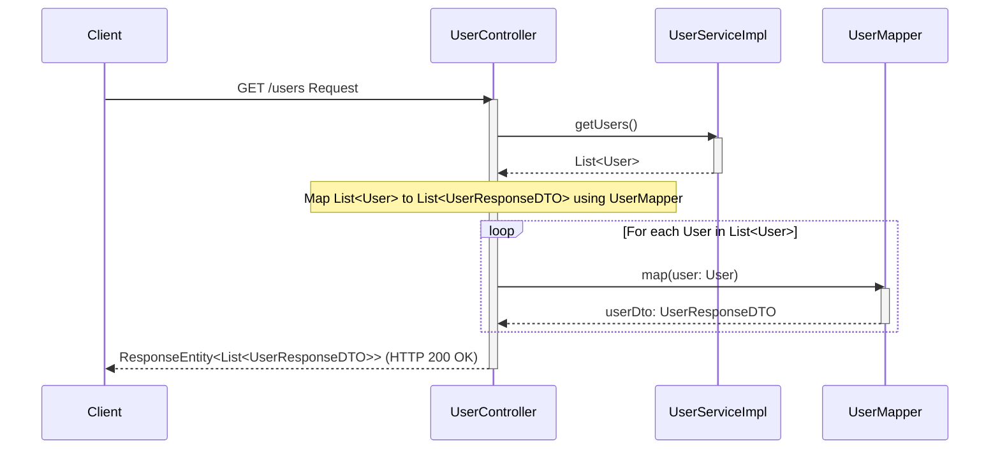

# Creando tu primer endpoint

Finalmente, manos a la obra. Vamos a crear un endpoint simple que devuelve un usuario: cuando visitemos [http://localhost:8080/users](http://localhost:8080/users), deberíamos obtener algo así:

```json
[
  {
    "id": 1,
    "name": "Leanne Graham",
    "username": "Bret",
    "email": "Sincere@april.biz"
  }
]
```

## Paso 0: Inicializar git

```bash
git init
git add .
git commit -m "Initial commit"
```

## Paso 1: Agregar un formatter (Spotless)

* **Agregá el plugin** en la sección de plugins (generalmente al principio de `build.gradle`):

    ```groovy title="build.gradle"
    id 'com.diffplug.spotless' version '6.25.0'
    ```

* **Agregá la configuración de Spotless** (al final de `build.gradle`). Lo siguiente es mi preferencia personal:

    ```groovy title="build.gradle"
    spotless {
        java {
            target 'src/*/java/**/*.java'
            googleJavaFormat()
            removeUnusedImports()
            cleanthat()
            formatAnnotations()
        }
        groovyGradle {
            target '*.gradle'
            greclipse()
        }
    }
    ```
    Para más info sobre configuraciones, chequeá el [repositorio de Spotless en GitHub](https://github.com/diffplug/spotless).

* **Auto-formateá en cada build**, agregando una nueva tarea:

    ```groovy title="build.gradle"
    tasks.named("build") {
        dependsOn 'spotlessApply'
        dependsOn 'spotlessGroovyGradleApply'
    }
    ```

* Ahora que todo está configurado, **ejecutá la tarea Build**.
* Guardá los cambios hechos hasta ahora:

    ```bash
    git add .
    git commit -m "spotless"
    ```

## Paso 2: Crear el modelo user

Un **modelo** es un plano para tus datos — define la estructura de la información que maneja tu aplicación.

<div>
   
</div>

_Otras carpetas se omiten por simplicidad._

Creá `User.java`.

```java title="src/main/java/com/dev/pollito/users_manager/domain/model/User.java"
package dev.pollito.users_manager.domain.model;

import static lombok.AccessLevel.PRIVATE;

import lombok.Builder;
import lombok.Data;
import lombok.experimental.FieldDefaults;

@Builder
@Data
@FieldDefaults(level = PRIVATE)
public class User {
  Long id;
  String name;
  String username;
  String email;
}
```

**Vamos a usar Lombok para evitar código boilerplate**. Lombok genera automáticamente código Java repetitivo al momento de compilar.

* Si tu IDE no tiene el plugin de Lombok instalado, vas a ver errores de compilación. Chequeá [Optimizando IntelliJ IDEA con plugins (para Java)](/prior-recommended-knowledge/ide#optimizando-intellij-idea-con-plugins-para-java) para ver cómo agregarlo.

## Paso 3: Crear el primary port y su implementación

* `UserService` es el Primary Port, definiendo las operaciones de usuario.
* `UserServiceImpl` es la implementación, conteniendo la lógica del dominio.

<div>
   
</div>

_Otras carpetas se omiten por simplicidad._

Creá `UserService.java`.

```java title="src/main/java/dev/pollito/users_manager/domain/port/in/UserService.java"
package dev.pollito.users_manager.domain.port.in;

import dev.pollito.users_manager.domain.model.User;
import java.util.List;

public interface UserService {
  List<User> getUsers();
}
```

Creá `UserServiceImpl.java`.

```java title="src/main/java/dev/pollito/users_manager/domain/service/UserServiceImpl.java"
package dev.pollito.users_manager.domain.service;

import dev.pollito.users_manager.domain.model.User;
import dev.pollito.users_manager.domain.port.in.UserService;
import java.util.List;
import org.springframework.stereotype.Service;

@Service
public class UserServiceImpl implements UserService {
  private static final User USER_1 =
      User.builder()
          .id(1L)
          .name("Leanne Graham")
          .username("Bret")
          .email("Sincere@april.biz")
          .build();

  @Override
  public List<User> getUsers() {
    return List.of(USER_1);
  }
}
```

* Por el momento, vamos a devolver un usuario hardcodeado.
* `@Service` le dice a Spring _acá tenés una implementación de `UserService`_.
* `@Override` indica que el método `public List<User> getUsers()` cumple el contrato de la interfaz.

## Paso 4: Crear el primary adapter

* El controlador actúa como un adaptador primario, convirtiendo peticiones HTTP a llamadas al servicio del dominio.
* El modelo de dominio no se expone directamente a los clientes; en su lugar, [se usan DTOs](https://www.baeldung.com/java-dto-pattern).

<div>
   
</div>

_Otras carpetas se omiten por simplicidad._

Creá `UserResponseDTO.java`. Contiene los datos a devolver como respuesta.

```java title="src/main/java/dev/pollito/users_manager/adapter/in/rest/dto/UserResponseDTO.java"
package dev.pollito.users_manager.adapter.in.rest.dto;

import static lombok.AccessLevel.PRIVATE;

import lombok.Builder;
import lombok.Data;
import lombok.experimental.FieldDefaults;

@Data
@Builder
@FieldDefaults(level = PRIVATE)
public class UserResponseDTO {
  Long id;
  String name;
  String username;
  String email;
}
```

Creá `UserMapper.java`. Convierte entre modelos de dominio y DTOs.

```java title="src/main/java/dev/pollito/users_manager/adapter/in/rest/mapper/UserMapper.java"
package dev.pollito.users_manager.adapter.in.rest.dto;

import static java.util.Objects.isNull;

import dev.pollito.users_manager.domain.model.User;
import org.springframework.stereotype.Component;

@Component
public class UserMapper {
  public UserResponseDTO map(User user) {
    if (isNull(user)) {
      return null;
    }

    return UserResponseDTO.builder()
        .id(user.getId())
        .name(user.getName())
        .username(user.getUsername())
        .email(user.getEmail())
        .build();
  }
}
```

Creá `UserController.java`. Actúa como un adaptador primario que convierte peticiones HTTP a llamadas al servicio.

```java title="src/main/java/dev/pollito/users_manager/adapter/in/rest/UserController.java"
package dev.pollito.users_manager.adapter.in.rest;

import dev.pollito.users_manager.adapter.in.rest.dto.UserResponseDTO;
import dev.pollito.users_manager.adapter.in.rest.mapper.UserMapper;
import dev.pollito.users_manager.domain.port.in.UserService;
import java.util.List;
import lombok.RequiredArgsConstructor;
import org.springframework.http.ResponseEntity;
import org.springframework.web.bind.annotation.GetMapping;
import org.springframework.web.bind.annotation.RequestMapping;
import org.springframework.web.bind.annotation.RestController;

@RestController
@RequestMapping("/users")
@RequiredArgsConstructor
public class UserController {
  private final UserService userService;
  private final UserMapper userMapper;

  @GetMapping
  public ResponseEntity<List<UserResponseDTO>> getUsers() {
    return ResponseEntity.ok(userService.getUsers().stream().map(userMapper::map).toList());
  }
}
```

* El controlador solo depende de la interfaz del servicio (puerto), no de su implementación.
* La lógica de mapeo se extrae a una clase mapper separada.
* Los objetos de dominio no se exponen a los clientes de la API.

## Ejecutá la aplicación

Hacé clic derecho en la clase principal → Run. Luego andá a [http://localhost:8080/users](http://localhost:8080/users).



1. **Client->>UserController:** Un cliente externo hace una petición GET al endpoint `/users`, que es manejado por el `UserController`.
2. **UserController->>UserServiceImpl:** El `UserController` llama al método `getUsers()` de la instancia inyectada de `UserService` (que está implementada por `UserServiceImpl`).
3. **UserServiceImpl-->>UserController:** El `UserServiceImpl` obtiene o genera la lista de objetos de dominio `User` y la devuelve al `UserController`.
4. **Nota sobre UserController:** El `UserController` procesa la lista de objetos `User` que recibió.
5. **loop For each User...end::** El código usa un stream de Java para recorrer la lista. Por cada objeto `User`:
   * **UserController->>UserMapper:** El `UserController` llama al método `map()` del `UserMapper` inyectado, pasándole el objeto `User` actual.
   * **UserMapper-->>UserController:** El `UserMapper` crea un `UserResponseDTO` a partir del objeto `User` y lo devuelve.
6. **UserController-->>Client:** Después de mapear todos los objetos `User` a `UserResponseDTO`s (resultando en una `List<UserResponseDTO>`), el `UserController` envuelve la lista en un `ResponseEntity.ok()` y devuelve la respuesta HTTP final (con un estado 200 OK) al cliente.

<div>
  
</div>

¡Felicidades! Tu app Spring Boot está lista, funcionando y exponiendo un endpoint. Commiteá el progreso hasta ahora.

```bash
git add .
git commit -m "/users devuelve usuario hardcodeado"
```