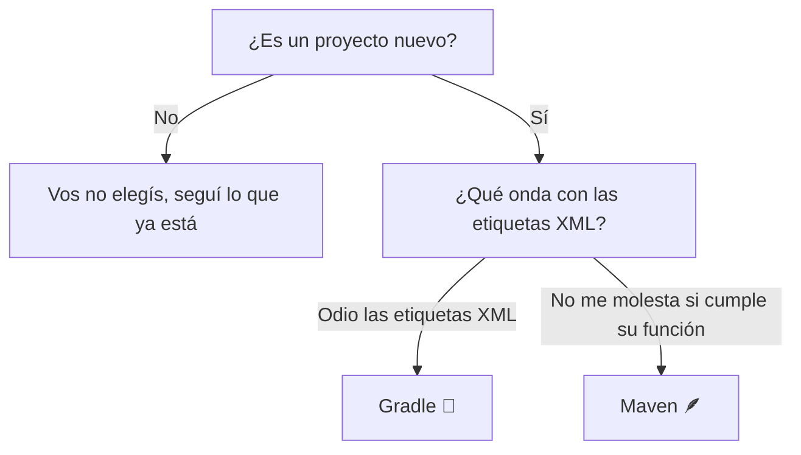

# Spring Initializr

Ve a [Spring Initializr](https://start.spring.io/), el generador oficial de proyectos Spring Boot (mención honorífica a [Bootify](https://bootify.io/), una alternativa interesante).

Vas a ver un formulario, pero tranquilo—vamos a descifrar cada opción.

  

## Project: Maven vs Gradle

## Spring Boot versions

Al seleccionar una versión de Spring Boot, vas a encontrar tres tipos de etiquetas:

* **SNAPSHOT**
  * Indica una build de desarrollo de Spring Boot.
  * Estas versiones son inestables, se está trabajando activamente en ellas y pueden incluir funcionalidades no probadas o bugs.
  * Evitá usarlas para producción, ya que pueden cambiar sin aviso.
* M1, M2, etc. (**Milestones**)
  * Son versiones pre-lanzamiento que marcan hitos importantes (por ejemplo, nuevas funcionalidades) antes de una versión estable.
  * Más estables que las SNAPSHOT, pero aún no listas para producción. Ideales para probar temprano las próximas funcionalidades.
* Sin etiqueta (**Stable Releases**)
  * Estas son versiones estables, rigurosamente probadas y listas para producción.

**Siempre optá por la versión estable más alta** (sin etiquetas SNAPSHOT/M) a menos que necesites explícitamente funcionalidades experimentales.

## Project metadata

La sección **Project Metadata** define la identidad y estructura de tu proyecto. Acá tenés un desglose de cada campo y sus convenciones recomendadas:

| Campo        | Qué significa                                                                 | Estructura/Estándar recomendado                                     | Ejemplo                                            |
|--------------|-------------------------------------------------------------------------------|---------------------------------------------------------------------|----------------------------------------------------|
| Group        | Identifica a tu organización/equipo                                           | Usá notación de nombre de dominio inverso. Evitá términos genéricos | `com.acme`                                         |
| Artifact     | El nombre del proyecto                                                        | Usá minúsculas y guiones para nombres con varias palabras           | `inventory-service`                                |
| Name         | Nombre legible para humanos                                                   | Usá espacios/mayúsculas para facilitar la lectura                   | Inventory Management                               |
| Description  | Breve resumen del propósito del proyecto. Agregado a `pom.xml`/`build.gradle` | Mantenelo conciso (1–2 oraciones) y específico                      | Microservicio para rastrear inventario del almacén |
| Package Name | Paquete Java raíz para el código fuente                                       | Derivado de Group + Artifact (se eliminan los guiones)              | `com.acme.inventoryservice`                        |

**Preferencia personal**: Me gusta usar guion bajo (_) en el nombre del artifact. No hay regla en contra, simplemente no es común. Pero siento que ayuda a mantener la consistencia, porque Spring Initializr va a reemplazar el guion por guion bajo en algunas carpetas.

## Packaging: JAR vs WAR

**Packaging** determina cómo se empaqueta tu aplicación en un único archivo, lo que permite que se ejecute sin problemas en cualquier sistema sin una configuración compleja.

| Formato | Mejor para                                                                                                                                                                 | Diferencia clave                                                                                               |
|---------|----------------------------------------------------------------------------------------------------------------------------------------------------------------------------|----------------------------------------------------------------------------------------------------------------|
| `JAR`   | Apps modernas de Spring Boot, microservicios, despliegues en la nube                                                                                                       | Contiene un servidor embebido (por ejemplo, [Tomcat](https://tomcat.apache.org/)) para ejecución autocontenida |
| `WAR`   | Apps legadas o despliegues en servidores externos (por ejemplo, Tomcat tradicional, [JBoss](https://www.redhat.com/en/technologies/jboss-middleware/application-platform)) | Requiere un servidor aparte para ejecutarse; no incluye servidor embebido                                      |

**Usá JAR a menos que estés atado a infraestructura legada**. `JAR` es el valor por defecto en Spring Boot. El servidor embebido de Spring Boot hace que `JAR` sea la opción ligera y sin complicaciones para la mayoría de los proyectos hoy en día.

## Java version

* Quedate con lo que usa tu equipo.
  * Si tu equipo está usando una versión vieja sin soporte, elegí la versión más baja que ofrezca Spring Initializr.
* Si no estás seguro, [elegí la última LTS](https://www.oracle.com/java/technologies/java-se-support-roadmap.html)—es el punto ideal.

## Dependencies

Las dependencias son librerías preconstruidas que agregan funciones específicas a tu app (como herramientas en una caja de herramientas). Por ahora, usaremos las que vas a necesitar en el 90% de los proyectos reales de Spring:

| Dependencia                                                                                                                                                          | Categoría             | Por qué la necesitás                                                                                |
|----------------------------------------------------------------------------------------------------------------------------------------------------------------------|-----------------------|-----------------------------------------------------------------------------------------------------|
| [Lombok](https://projectlombok.org/)                                                                                                                                 | Developer Tools       | Reduce código repetitivo (por ejemplo, getters/setters) con anotaciones simples                     |
| [Spring Boot Actuator](https://docs.spring.io/spring-boot/docs/3.3.4/reference/htmlsingle/index.html#actuator)                                                       | Operations/Monitoring | Agrega chequeos de salud, métricas y endpoints de gestión para tu app                               |
| [Spring Boot DevTools](https://docs.spring.io/spring-boot/docs/3.3.4/reference/htmlsingle/index.html#using.devtools)                                                 | Developer Tools       | Acelera el desarrollo con reinicios automáticos, LiveReload y configuración amigable para debugging |
| [Spring Configuration Processor](https://docs.spring.io/spring-boot/docs/3.3.4/reference/htmlsingle/index.html#appendix.configuration-metadata.annotation-processor) | Developer Tools       | Habilita autocompletado para configuraciones personalizadas en `application.properties`/`yml`       |
| [Spring Web](https://docs.spring.io/spring-boot/docs/3.3.4/reference/htmlsingle/index.html#web)                                                                      | Web                   | Para construir APIs REST con Spring MVC + servidor Tomcat embebido                                  |

## Generate

Una vez que configuraste tu app Spring Boot, dale al botón Generate (o Ctrl + Enter). Spring Initializr va a empaquetar tu proyecto en un archivo .zip.

En esta captura de pantalla de abajo, estoy creando **la aplicación Users Manager que vamos a desarrollar durante el resto de esta guía**.

  

¿Qué hay dentro del zip?

* Una estructura de proyecto estándar (carpetas para código, tests, configuraciones).
* Archivos `pom.xml` (Maven) o `build.gradle` (Gradle) preconfigurados.
* Un archivo `application.properties` inicial.
* La clase principal (`*Application.java`) para ejecutar tu app.

¡No te preocupes por los detalles todavía – vamos a descomprimir y explorar todo juntos en los próximos pasos!