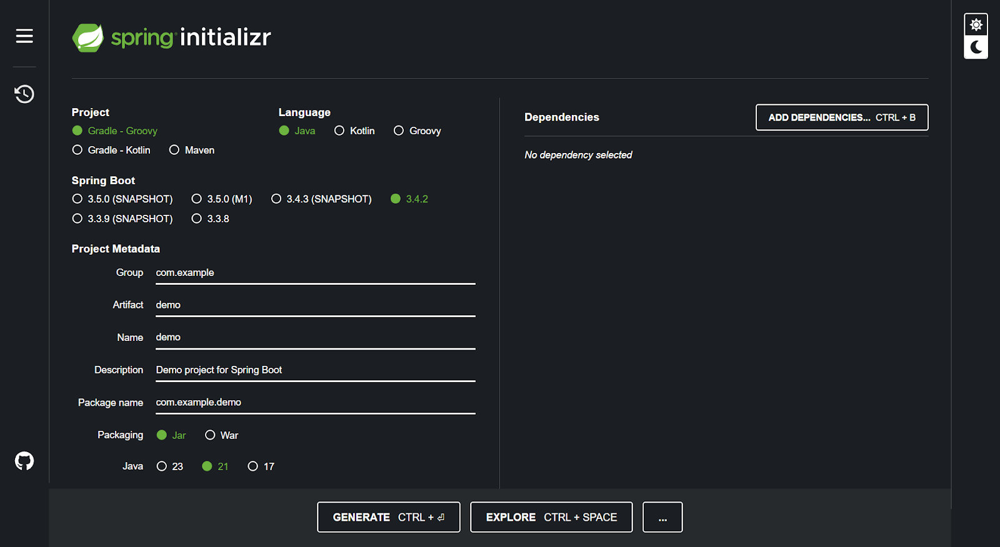
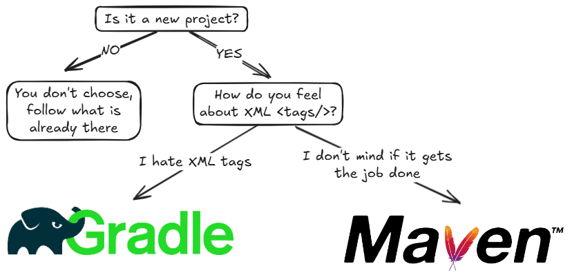
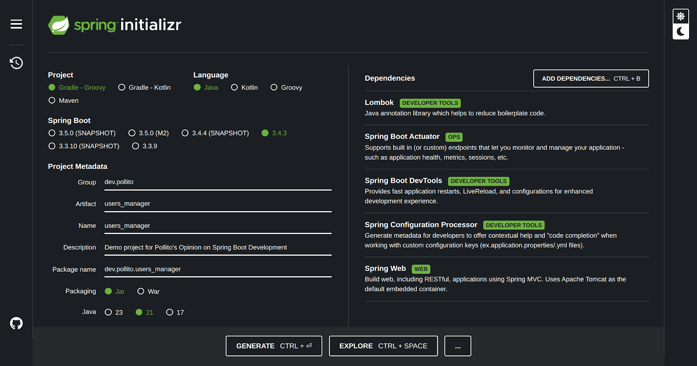

# Spring Initializr

Ve a [Spring Initializr](https://start.spring.io/), el generador oficial de proyectos Spring Boot (mención honorífica a [Bootify](https://bootify.io/), una alternativa interesante).

Vas a ver un formulario, pero tranquilo—vamos a decodificar cada opción.

## Proyecto: Maven vs Gradle

Pensá en estos como los managers de tu proyecto. Ellos:

* Descargan las librerías/dependencias.
* Definen los pasos (compilar el código, correr tests, construir archivos `JAR`).
* Mantienen la estructura del proyecto estándar y ordenada.

| Aspecto       | Maven                                     | Gradle                                                   |
|---------------|-------------------------------------------|----------------------------------------------------------|
| Configuración | Usa XML (estructurado con `<tags>`)       | Usa Kotlin/Groovy (sintaxis parecida a código)           |
| Flexibilidad  | Estricto, con convenciones estandarizadas | Altamente personalizable (soporta lógica tipo `if-else`) |
| Casos de Uso  | Proyectos Java legados o empresariales    | Apps Android, proyectos modernos en Java/Kotlin          |

### ¿Cuál Elegir?

### Por Qué No Importa

Ambos van a:

* Descargar las dependencias de Spring Boot de la misma manera.
* Crear el mismo archivo JAR ejecutable.

Decidir entre Maven y Gradle es como pelearse para ver si usar una licuadora o un procesador de alimentos – ambos hacen smoothies, solo que con botones distintos. Spring Initializr se encarga de toda la configuración complicada de cualquier forma.

## Versiones de Spring Boot

Al seleccionar una versión de Spring Boot te vas a topar con tres tipos de etiquetas:

* **SNAPSHOT**
  * Indica una build de desarrollo de Spring Boot.
  * Estas versiones son inestables, están en constante cambio y pueden incluir características sin probar o bugs.
  * Evitalas para producción, ya que pueden cambiar sin previo aviso.
* M1, M2, etc. (**Milestones**)
  * Versiones pre-release que marcan hitos importantes (por ejemplo, nuevas características) antes de una versión estable.
  * Más estables que SNAPSHOT, pero aún no listas para producción. Ideales para probar características que vienen.
* Sin Marcador (**Versiones Estables**)
  * Estas son versiones estables, rigorosamente probadas y listas para producción.

**Optá siempre por la versión estable más alta** (sin etiquetas SNAPSHOT/M) a menos que necesites características experimentales.

## Metadatos del Proyecto

La sección de **Metadatos del Proyecto** define la identidad y la estructura de tu proyecto. Acá te explico cada campo y sus convenciones recomendadas:

| Campo        | Qué Significa                                                                  | Estructura/Estándar Recomendado                                 | Ejemplo                                               |
|--------------|--------------------------------------------------------------------------------|-----------------------------------------------------------------|-------------------------------------------------------|
| Group        | Identifica a tu organización/equipo                                            | Usá la notación de dominio invertido. Evitá términos genéricos  | `com.acme`                                            |
| Artifact     | El nombre del proyecto                                                         | Usá letras minúsculas y guiones para nombres de varias palabras | `inventory-service`                                   |
| Name         | Nombre a mostrar, legible para humanos                                         | Usá espacios y mayúsculas para mejor lectura                    | Inventory Management                                  |
| Description  | Resumen breve del propósito del proyecto. Se agrega a `pom.xml`/`build.gradle` | Mantenelo conciso (1–2 oraciones) y específico                  | Microservicio para gestionar el inventario de almacén |
| Package Name | Paquete raíz de Java para el código fuente                                     | Derivado de Group + Artifact (sin guiones)                      | `com.acme.inventoryservice`                           |

**Preferencia personal**: A mí me gusta usar el guion bajo ( _ ) en el nombre del artifact. No hay regla en contra, solo que no es común. Pero yo siento que ayuda a mantener la consistencia, ya que Spring Initializr va a reemplazar el guion por un guion bajo en algunas carpetas.

## Packaging: JAR vs WAR

El **Packaging** determina cómo se empaca tu aplicación en un solo archivo compartible, permitiendo que corra sin problemas en cualquier sistema sin necesidad de configuraciones complicadas.

| Formato | Ideal para                                                                                                                                                                 | Principales Diferencias                                                                                    |
|---------|----------------------------------------------------------------------------------------------------------------------------------------------------------------------------|------------------------------------------------------------------------------------------------------------|
| `JAR`   | Apps modernas de Spring Boot, microservicios, despliegues en la nube                                                                                                       | Contiene servidor embebido (por ejemplo, [Tomcat](https://tomcat.apache.org/)) para una ejecución autónoma |
| `WAR`   | Apps legadas o despliegues en servidores externos (por ejemplo, Tomcat tradicional, [JBoss](https://www.redhat.com/en/technologies/jboss-middleware/application-platform)) | Requiere un servidor separado para ejecutarse; no incluye servidor embebido                                |

**Usá JAR a menos que estés atado a una infraestructura legada**. JAR es el default en Spring Boot. El servidor embebido de Spring Boot hace de JAR la opción liviana y sin complicaciones para la mayoría de los proyectos de hoy.

## Versión de Java

* Quedate con la que usa tu equipo.
  * Si el equipo está usando una versión antigua sin soporte, elegí la versión mínima que Spring Initializr ofrezca.
* Si no estás seguro, [elegí la última LTS](https://www.oracle.com/java/technologies/java-se-support-roadmap.html)—es el punto ideal.

## Dependencias

Las dependencias son librerías preconstruidas que le agregan funciones específicas a tu app (como herramientas en una caja de herramientas). Por ahora, usaremos las que vas a necesitar en el 90% de los proyectos Spring reales:

| Dependencia                                                                                                                                                          | Categoría             | Por Qué La Necesitás                                                                                      |
|----------------------------------------------------------------------------------------------------------------------------------------------------------------------|-----------------------|-----------------------------------------------------------------------------------------------------------|
| [Lombok](https://projectlombok.org/)                                                                                                                                 | Herramientas para Dev | Reduce el código repetitivo (por ejemplo, getters/setters) con anotaciones simples                        |
| [Spring Boot Actuator](https://docs.spring.io/spring-boot/docs/3.3.4/reference/htmlsingle/index.html#actuator)                                                       | Operaciones/Monitoreo | Agrega health checks, métricas y endpoints de gestión para tu app                                         |
| [Spring Boot DevTools](https://docs.spring.io/spring-boot/docs/3.3.4/reference/htmlsingle/index.html#using.devtools)                                                 | Herramientas para Dev | Acelera el desarrollo con auto-restarts, LiveReload y configuraciones amigables para debug                |
| [Spring Configuration Processor](https://docs.spring.io/spring-boot/docs/3.3.4/reference/htmlsingle/index.html#appendix.configuration-metadata.annotation-processor) | Herramientas para Dev | Habilita la autocompletar de código para configuraciones personalizadas en `application.properties`/`yml` |
| [Spring Web](https://docs.spring.io/spring-boot/docs/3.3.4/reference/htmlsingle/index.html#web)                                                                      | Web                   | Construye APIs REST con Spring MVC + servidor Tomcat embebido                                             |

## Generar

Una vez que hayas configurado tu app con Spring Boot, dale al botón Generate (o Ctrl + Enter). Spring Initializr empaquetará tu proyecto en un archivo .zip.

En la siguiente captura, estoy creando la **aplicación Users Manager que vamos a desarrollar durante el resto de esta guía**.

¿Qué tiene adentro el zip?

* Una estructura estándar de proyecto (carpetas para código, tests, configuraciones).
* `pom.xml` preconfigurado (si elegiste Maven) o `build.gradle` (si elegiste Gradle).
* Un archivo starter `application.properties`.
* La clase principal (`*Application.java`) para ejecutar tu app.

¡No te preocupes por los detalles todavía – vamos a descomprimir y explorar todo juntos en los próximos pasos!