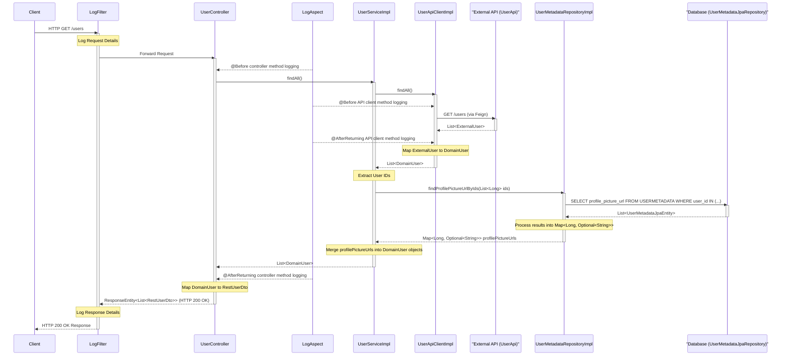

# Integración con base de datos

Actualmente, la aplicación obtiene datos de usuario del [endpoint /users de \{JSON\} Placeholder](https://jsonplaceholder.typicode.com/users), pero le faltan las URL de la foto de perfil (`profilePictureUrl` es nulo).

<div>
  
</div>

Necesitamos mejorar la aplicación para obtener y almacenar las URL de la foto de perfil en una base de datos. Implementaremos esto usando una base de datos en memoria H2.

## Agregar dependencias

Necesitamos [H2 Database Engine](https://mvnrepository.com/artifact/com.h2database/h2) y [Spring Boot Starter Data JPA](https://mvnrepository.com/artifact/org.springframework.boot/spring-boot-starter-data-jpa). Agregalas en la sección de `dependencies` de `build.gradle`:

```groovy
runtimeOnly 'com.h2database:h2:2.3.232'
implementation 'org.springframework.boot:spring-boot-starter-data-jpa'
```

## Datos mock

Esta es la representación de las URLs de la foto de perfil almacenadas en una base de datos.

* El nombre de este archivo debe ser `data.sql`. Si no, H2 no podrá proporcionar los datos mockeados.

```sql title="src/main/resources/data.sql"
-- Create users table
CREATE TABLE IF NOT EXISTS public.USERMETADATA (
    id INT AUTO_INCREMENT PRIMARY KEY,
    user_id INT UNIQUE,
    profile_picture_url VARCHAR(255) NOT NULL
);

-- Inserting into the public.USERMETADATA table
INSERT INTO public.USERMETADATA (user_id, profile_picture_url) VALUES (1, 'https://raw.githubusercontent.com/PokeAPI/sprites/master/sprites/pokemon/other/official-artwork/1.png');
INSERT INTO public.USERMETADATA (user_id, profile_picture_url) VALUES (2, 'https://raw.githubusercontent.com/PokeAPI/sprites/master/sprites/pokemon/other/official-artwork/2.png');
INSERT INTO public.USERMETADATA (user_id, profile_picture_url) VALUES (3, 'https://raw.githubusercontent.com/PokeAPI/sprites/master/sprites/pokemon/other/official-artwork/3.png');
INSERT INTO public.USERMETADATA (user_id, profile_picture_url) VALUES (4, 'https://raw.githubusercontent.com/PokeAPI/sprites/master/sprites/pokemon/other/official-artwork/4.png');
INSERT INTO public.USERMETADATA (user_id, profile_picture_url) VALUES (5, 'https://raw.githubusercontent.com/PokeAPI/sprites/master/sprites/pokemon/other/official-artwork/5.png');
INSERT INTO public.USERMETADATA (user_id, profile_picture_url) VALUES (6, 'https://raw.githubusercontent.com/PokeAPI/sprites/master/sprites/pokemon/other/official-artwork/6.png');
INSERT INTO public.USERMETADATA (user_id, profile_picture_url) VALUES (7, 'https://raw.githubusercontent.com/PokeAPI/sprites/master/sprites/pokemon/other/official-artwork/7.png');
INSERT INTO public.USERMETADATA (user_id, profile_picture_url) VALUES (8, 'https://raw.githubusercontent.com/PokeAPI/sprites/master/sprites/pokemon/other/official-artwork/8.png');
INSERT INTO public.USERMETADATA (user_id, profile_picture_url) VALUES (9, 'https://raw.githubusercontent.com/PokeAPI/sprites/master/sprites/pokemon/other/official-artwork/9.png');
INSERT INTO public.USERMETADATA (user_id, profile_picture_url) VALUES (10, 'https://raw.githubusercontent.com/PokeAPI/sprites/master/sprites/pokemon/other/official-artwork/10.png');
```

## Propiedades H2

Agregá las propiedades de H2 en `application.yml`. El resultado debería verse algo así:

```yaml title="src/main/resources/application.yml"
jsonplaceholder:
  baseUrl: https://jsonplaceholder.typicode.com/
logging:
  level:
    org.hibernate.SQL: DEBUG
spring:
  application:
    name: users_manager
  datasource:
    url: jdbc:h2:mem:testdb;DB_CLOSE_DELAY=-1;DB_CLOSE_ON_EXIT=FALSE;AUTO_RECONNECT=TRUE;INIT=CREATE SCHEMA IF NOT EXISTS PUBLIC
    username: sa
    password: password
    driverClassName: org.h2.Driver
  h2:
    console.enabled: true
  jpa:
    database-platform: org.hibernate.dialect.H2Dialect
    defer-datasource-initialization: true
    properties:
      hibernate:
        dialect: org.hibernate.dialect.H2Dialect
```

## Secondary port

<div>
  
</div>

_Otras carpetas se omiten por simplicidad._

```java title="src/main/java/dev/pollito/users_manager/domain/port/out/UserMetadataRepository.java"
package dev.pollito.users_manager.domain.port.out;

import java.util.List;
import java.util.Map;
import java.util.Optional;

public interface UserMetadataRepository {
  Map<Long, Optional<String>> findProfilePictureUrlByIds(List<Long> ids);
}
```

El método `findProfilePictureUrlByIds` está diseñado para buscar las fotos de perfil de múltiples usuarios de manera eficiente en una sola operación.

* Quien llame proporcionaría una lista de ID de usuario y recibiría un mapa donde cada ID está mapeado a un Optional que contiene la URL de la foto de perfil (si existen metadatos para ese usuario) o un `Empty Optional` (si no existen metadatos).
* Este patrón de recuperación por lotes ayuda a evitar los [problemas de consultas N+1](https://planetscale.com/blog/what-is-n-1-query-problem-and-how-to-solve-it) al mostrar listas de usuarios con sus fotos de perfil.

## Secondary adapter (JPA)

### ¿Por qué no recomiendo generar clases Entity?

Aunque existe una forma de generar estas clases entity en el ecosistema Java/JPA/Spring Boot ([Hibernate Tools Maven Plugin](https://mvnrepository.com/artifact/org.hibernate/hibernate-tools-maven-plugin), análogo a los generadores OpenAPI para clientes/servidores API), **no se recomienda debido a su menor confiabilidad**:

* Requiere una conexión a la base de datos, ya que se basa en la introspección de bases de datos en tiempo real. En casi todos los proyectos en los que trabajé, los desarrolladores no tienen conexión a la base de datos (eso está reservado para los entornos de testing y producción).
* Las clases entity generadas suelen ser un excelente punto de partida, pero casi con seguridad necesitarás revisarlas y posiblemente ajustarlas:
    * Las relaciones complejas (especialmente `ManyToMany` con tablas de unión) pueden no mapearse correctamente.
    * Los nombres generados podrían no coincidir perfectamente con tus convenciones de nomenclatura de Java (por ejemplo, `USER_TABLE` -> `UserTable` en lugar de `User`).
    * Los tipos de base de datos pueden no mapearse a los tipos de Java deseados (por ejemplo, `TIMESTAMP` a Instant o `LocalDateTime`).

### Creá la Entity

<div>
  
</div>

_Otras carpetas se omiten por simplicidad._

```java title="src/main/java/dev/pollito/users_manager/adapter/out/jpa/entity/UserMetadataJpaEntity.java"
package dev.pollito.users_manager.adapter.out.jpa.entity;

import jakarta.persistence.Column;
import jakarta.persistence.Entity;
import jakarta.persistence.GeneratedValue;
import jakarta.persistence.GenerationType;
import jakarta.persistence.Id;
import jakarta.persistence.Table;
import lombok.AccessLevel;
import lombok.AllArgsConstructor;
import lombok.Getter;
import lombok.NoArgsConstructor;
import lombok.Setter;
import lombok.experimental.FieldDefaults;

@Entity
@Table(name = "USERMETADATA")
@Getter
@Setter
@NoArgsConstructor
@AllArgsConstructor
@FieldDefaults(level = AccessLevel.PRIVATE)
public class UserMetadataJpaEntity {
  @Id
  @GeneratedValue(strategy = GenerationType.IDENTITY)
  @Column(name = "id")
  Long id;

  @Column(name = "user_id", unique = true, nullable = false)
  Long userId;

  @Column(name = "profile_picture_url", nullable = false)
  String profilePictureUrl;
}
```

### Extender JpaRepository

<div>
  
</div>

_Otras carpetas se omiten por simplicidad._

```java title="src/main/java/dev/pollito/users_manager/adapter/out/jpa/repository/UserMetadataJpaRepository.java"
package dev.pollito.users_manager.adapter.out.jpa.repository;

import dev.pollito.users_manager.adapter.out.jpa.entity.UserMetadataJpaEntity;
import java.util.List;
import org.springframework.data.jpa.repository.JpaRepository;

public interface UserMetadataJpaRepository extends JpaRepository<UserMetadataJpaEntity, Long> {
  List<UserMetadataJpaEntity> findByUserIdIn(List<Long> userIds);
}
```

Si bien Spring Data JPA puede generar métodos automáticamente para consultas simples, `findByUserIdIn` debe definirse explícitamente porque Spring Data JPA genera métodos de consulta basados en convenciones de nomenclatura.

* Spring analiza el nombre del método (`findByUserIdIn`) para entender que querés encontrar entidades donde los valores del campo userId coincidan con los de la colección proporcionada.

Si necesitas una búsqueda más específica o compleja de lo que `JpaRepository` puede deducir solo del nombre de un método, la [@Query annotation](https://www.baeldung.com/spring-data-jpa-query) te permite dar instrucciones personalizadas escritas en un lenguaje similar a base de datos ([JPQL](https://www.baeldung.com/spring-data-jpa-query), que se parece mucho a SQL).

### Implementar el Secondary Port

```java title="src/main/java/dev/pollito/users_manager/adapter/out/jpa/UserMetadataRepositoryImpl.java"
package dev.pollito.users_manager.adapter.out.jpa;

import static java.util.Optional.ofNullable;
import static java.util.function.UnaryOperator.identity;
import static java.util.stream.Collectors.toMap;

import dev.pollito.users_manager.adapter.out.jpa.entity.UserMetadataJpaEntity;
import dev.pollito.users_manager.adapter.out.jpa.repository.UserMetadataJpaRepository;
import dev.pollito.users_manager.domain.port.out.UserMetadataRepository;
import java.util.List;
import java.util.Map;
import java.util.Optional;
import lombok.RequiredArgsConstructor;
import org.springframework.stereotype.Service;

@Service
@RequiredArgsConstructor
public class UserMetadataRepositoryImpl implements UserMetadataRepository {
  private final UserMetadataJpaRepository userMetadataJpaRepository;

  @Override
  public Map<Long, Optional<String>> findProfilePictureUrlByIds(List<Long> ids) {
    Map<Long, UserMetadataJpaEntity> entityMap =
        userMetadataJpaRepository.findByUserIdIn(ids).stream()
            .collect(toMap(UserMetadataJpaEntity::getUserId, identity()));

    return ids.stream()
        .collect(
            toMap(
                id -> id,
                id ->
                    ofNullable(entityMap.get(id))
                        .map(UserMetadataJpaEntity::getProfilePictureUrl)));
  }
}
```

Esta clase mantiene el contrato definido por la interfaz del Secondary Port mientras oculta los detalles de implementación de JPA a la capa de servicio.

### ¿Por qué esta implementación no necesita un Mapper?

En la implementación actual, no necesitamos un mapper porque solo estamos extrayendo una única propiedad `String` (`profilePictureUrl`) y devolviéndola envuelta en un `Optional`.

Si estuviéramos implementando algo como esto en su lugar:

```java
public interface UserMetadataRepository {
  Map<Long, Optional<UserMetadata>> findUserMetadataByIds(List<Long> ids);
}
```

Donde `UserMetadata` es un objeto de modelo de dominio, necesitaríamos un mapper para:

* **Transformar Entity a Domain**: Convertir `UserMetadataJpaEntity` → objeto de dominio `UserMetadata`.
* **Isolar Domain de Persistence**: Asegurar que los objetos de dominio no contengan detalles específicos de JPA.
* **Aplicar Business Rules**: Manejar cualquier lógica de negocio durante la transformación.
* **Type Conversion**: Gestionar diferentes tipos de propiedades o estructuras entre la entity y los modelos de dominio.

En una aplicación más grande que sigue estrictamente la arquitectura hexagonal, algunos equipos aún podrían crear un mapper por consistencia y para prepararse para futuras extensiones. Pero para el caso de uso actual y limitado, el acceso directo a propiedades es pragmático y limpio.

## Usar el Secondary Port

Modificá `UserServiceImpl` para que la aplicación use el repository.

```java title="src/main/java/dev/pollito/users_manager/domain/service/UserServiceImpl.java"
package dev.pollito.users_manager.domain.service;

import dev.pollito.users_manager.domain.model.User;
import dev.pollito.users_manager.domain.port.in.UserService;
import dev.pollito.users_manager.domain.port.out.UserApiClient;
import dev.pollito.users_manager.domain.port.out.UserMetadataRepository;
import java.util.List;
import java.util.Map;
import java.util.Optional;
import lombok.RequiredArgsConstructor;
import org.springframework.stereotype.Service;

@Service
@RequiredArgsConstructor
public class UserServiceImpl implements UserService {
  private final UserApiClient userApiClient;
  private final UserMetadataRepository userMetadataRepository;

  @Override
  public List<User> findAll() {
    List<User> users = userApiClient.findAll();
    Map<Long, Optional<String>> profilePictureUrls =
        userMetadataRepository.findProfilePictureUrlByIds(users.stream().map(User::getId).toList());
    users.forEach(
        user -> profilePictureUrls.get(user.getId()).ifPresent(user::setProfilePictureUrl));
    return users;
  }

  @Override
  public User findById(Long id) {
    User user = userApiClient.findById(id).orElseThrow();
    userMetadataRepository
        .findProfilePictureUrlByIds(List.of(id))
        .get(id)
        .ifPresent(user::setProfilePictureUrl);
    return user;
  }
}
```

## Ejecutá la aplicación

Hacé clic derecho en la clase principal → Run. Luego andá a [http://localhost:8080/users](http://localhost:8080/users).



1. **Petición del cliente:** Un `Cliente` inicia el proceso mandando una petición HTTP GET al endpoint `/users`.
2. **Filtro de logging:** La petición es primero interceptada por el `LogFilter`, que loguea detalles sobre la petición entrante y luego la deja pasar.
3. **Entrada al controlador:** La petición llega al `UserController`, que es el encargado de manejar las peticiones de la API.
4. **Logging del aspecto (antes del controlador):** El `LogAspect` loguea que se está llamando al método `UserController.findAll()`.
5. **Delegar al servicio:** El `UserController` delega la lógica de negocio principal al `UserServiceImpl` llamando a su método `findAll()`.
6. **Lógica del servicio (obtener datos base):** El `UserServiceImpl` necesita los datos base de los usuarios. Llama al método `findAll()` del `UserApiClientImpl`.
7. **Logging del aspecto (antes del cliente de API):** El `LogAspect` loguea la llamada a `UserApiClientImpl.findAll()`.
8. **Llamada a la API externa:** El `UserApiClientImpl` hace una llamada de red real a la *API Externa* usando su interfaz de cliente Feign (`UserApi`) para obtener una lista de usuarios en el formato de la API externa (`List<ExternalUser>`).
9. **Respuesta de la API externa:** La API Externa responde con los datos de los usuarios.
10. **Logging del aspecto (después del cliente de API):** El `LogAspect` loguea la respuesta recibida del `UserApiClientImpl` (antes del mapeo).
11. **Mapeo (externo a dominio):** *Dentro* del `UserApiClientImpl`, los datos de la API externa (`List<ExternalUser>`) son mapeados al modelo interno `List<DomainUser>` de la aplicación usando `AdapterOutRestUserMapper`.
12. **Lógica del servicio (obtener metadatos):** El `UserServiceImpl` ahora tiene los datos base de los usuarios. Extrae los ID de usuario de la `List<DomainUser>`. Para obtener las imágenes de perfil, llama al método `findProfilePictureUrlByIds()` del `UserMetadataRepositoryImpl`, pasándole los ID extraídos.
13. **Consulta a la base de datos:** El `UserMetadataRepositoryImpl` interactúa con la *Base de Datos* usando su `UserMetadataJpaRepository` para consultar las URLs de las imágenes de perfil asociadas a los IDs de usuario proporcionados.
14. **Respuesta de la base de datos:** La *Base de Datos* devuelve las entidades de metadatos de usuario que coinciden (`List<UserMetadataJpaEntity>`).
15. **Procesando resultados de la base de datos:** *Dentro* del `UserMetadataRepositoryImpl`, los resultados crudos de la base de datos son procesados y transformados en un `Map<Long, Optional<String>>`, mapeando los IDs de usuario a sus URL opcionales de imágenes de perfil.
16. **Lógica del servicio (fusionar datos):** El `UserServiceImpl` toma la `List<DomainUser>` y el mapa `profilePictureUrls` y fusiona los datos. Itera a través de los usuarios y establece la `profilePictureUrl` en cada objeto `DomainUser` si encuentra una URL en el mapa para el ID de ese usuario. La `List<DomainUser>` enriquecida es luego devuelta al `UserController`.
17. **Logging del aspecto (después del controlador):** El `LogAspect` loguea la lista de usuarios de dominio devuelta por el `UserServiceImpl` al `UserController`.
18. **Mapeo (dominio a DTO de REST):** *Dentro* del `UserController`, la `List<DomainUser>` es mapeada al formato `List<RestUserDto>` adecuado para la respuesta de la API usando el `AdapterInRestUserMapper`.
19. **Construir respuesta:** El `UserController` crea una `ResponseEntity` conteniendo la `List<RestUserDto>` y el estado HTTP (200 OK). Esta respuesta es devuelta.
20. **Filtro de logging:** La respuesta vuelve a pasar por el `LogFilter`, que loguea el estado de la respuesta y otros detalles.
21. **Respuesta al cliente:** Finalmente, el `LogFilter` manda la respuesta HTTP completa de vuelta al `Cliente`.

<div>
  
</div>

¡Felicidades! Tu app Spring Boot está:

* Lista y funcionando.
* Obteniendo información de usuarios de una fuente externa.
* Complementando la información de usuarios consultando una base de datos.

Commiteá el progreso hasta ahora.

```bash
git add .
git commit -m "integración con base de datos"
```

## Próximos pasos

### Actualizar unit tests

Si querés que el mutation testing se aplique a la clase `UserMetadataRepositoryImpl` recién creada, tenés que agregar su ubicación a la configuración de `pitest` en `build.gradle`.

```groovy title="build.gradle"
pitest {
	junit5PluginVersion = '1.2.1'
	outputFormats = ['HTML']
	targetClasses = [
		"${project.group}.${project.name}.adapter.in.rest.*".toString(),
		"${project.group}.${project.name}.adapter.out.rest.*".toString(),
		"${project.group}.${project.name}.adapter.out.jpa.*".toString(),
		"${project.group}.${project.name}.config.advice.*".toString(),
		"${project.group}.${project.name}.domain.service.*".toString(),
	]
	excludedClasses = [
		// excluir todos los subpaquetes en adapter.in.rest, como mappers y código generado por openApi
		"${project.group}.${project.name}.adapter.in.rest.*.*".toString(),
		// excluir todos los subpaquetes en adapter.out.rest, como mappers
		"${project.group}.${project.name}.adapter.out.rest.*.*".toString(),
		// excluir todos los subpaquetes en adapter.out.jpa, como entities
		"${project.group}.${project.name}.adapter.out.jpa.*.*".toString(),
	]
	targetTests = [
		"${project.group}.${project.name}.*".toString()
	]
	timestampedReports = false
	useClasspathFile = true
}
```